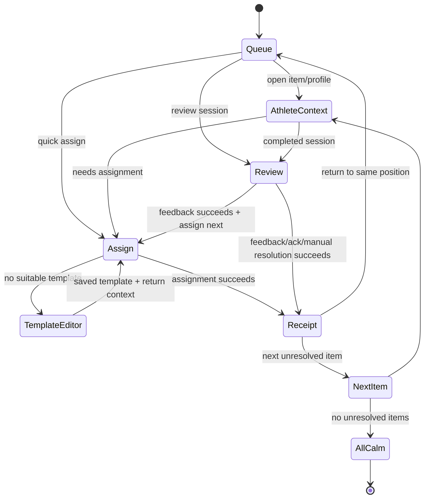

# Assign and Review Loop UX Map v1

Date: 2026-07-16  
Scope: dashboard -> attention -> athlete context -> assign/review -> resolution -> next client.

## Current surface map

| Surface | Current role | Current state/data behavior | UX assessment |
|---|---|---|---|
| Dashboard home | Team state, queue, drawer entry | Home mocks and local completion handlers | Strong concept, non-canonical state. |
| Attention Center | Dense queue/lifecycle | Separate inline mock and statuses | Duplicate/unclear. |
| Athlete profile | Identity, tabs, assign/review entry | Separate profile mock; local drawer state | Strong profile, source context lost. |
| Quick Assign | Recommend/select/assign | Static templates and callback-only result | Visual prototype only. |
| Workout Review drawer | Fast exceptions/feedback | Static review data and callbacks | Strong compact concept, parallel implementation. |
| Workout Review page | Detailed session review | Route-keyed inline mock; local reviewed boolean | Strong complex-review foundation. |
| Next-client behavior | Advance queue | Implemented in selected local callbacks only | No shared rule or persisted context. |

## Required context envelope

Every transition from a queue item should carry or derive:

| Field | Purpose |
|---|---|
| `attentionItemId` | Stable work-item identity. |
| `sourceType` and `sourceId` | Completed session/event that explains the item. |
| `athleteId` / relation | Correct person and authorization context. |
| `reason` and priority reasons | Human explanation without re-deriving divergent copy. |
| `recommendedAction` | Initial CTA, not an irreversible command. |
| `origin` | Dashboard, all-items queue, profile, or notification. |
| `queueView` / order token | Return to same position and choose deterministic next item. |
| `presentationHint` | Drawer or page based on complexity, never a separate domain flow. |

The envelope is a UX contract, not a Stage 5 backend implementation.

## Assign flow

Target:

```text
trainer sees client context
→ selects Create/Assign
→ chooses existing template
→ adjusts assignment snapshot
→ confirms assignment
→ receives confirmation
→ returns to context or queue
```

| Step | Current UI | Desired behavior | Preserved context | Missing state | Primary / secondary action |
|---|---|---|---|---|---|
| 1. See context | Dashboard card, profile Training tab, Quick Assign client column | Show source reason, athlete, current assignment state, relevant recent load | Item, athlete, origin, queue position | Neutral versus attention entry | `Назначить`; secondary `Открыть профиль`. |
| 2. Choose template | Static three-template list in Quick Assign | Query saved valid WorkoutTemplate revisions; search/recent/favorite are presentation filters | Athlete and source item | No templates, loading, failed load | `Выбрать`; secondary `Создать шаблон`. |
| 3. Adjust snapshot | Strategy chips and previous loads | Show scheduled time/date, note, and allowed athlete-specific prescription overrides on independent snapshot | Selected template revision | Invalid date, stale template, unstarted existing assignment | `Продолжить`; secondary `Назад к шаблонам`. |
| 4. Confirm | Current footer calls callback | Summarize athlete, template revision, date, changed fields, and effect on source item | Entire context envelope | Duplicate assignment, save in progress, conflict | `Назначить`; secondary `Отмена`. |
| 5. Receipt | Toast/local card removal | Confirm assignment identity and what happened to AttentionItem | Result + origin | Notification failure, item not auto-resolved rule | `Следующий клиент`; secondary `Открыть назначение/вернуться`. |
| 6. Return/next | Some `Назначить и следующий` callbacks | Restore profile tab or queue position; deterministic next unresolved item | Queue token | Queue empty, next item changed concurrently | `Следующий`; secondary `К спортсмену` / `К очереди`. |

### Assignment resolution rule

Assignment must not automatically resolve every AttentionItem merely because a button was clicked. The source item type must define whether a successful assignment is the accepted outcome. The UI receipt must state either “задача закрыта” or “назначение создано, требуется еще действие.”

### When a drawer is enough

- Existing saved template is suitable.
- Athlete context and previous load are concise.
- Only limited snapshot adjustments are needed.
- No conflicting/unstarted assignment requires comparison.

### When to open full Builder/editor

- No suitable template exists.
- Coach wants to create or substantially change reusable structure.
- Multiple exercises/prescriptions need authoring.
- Save failure/conflict requires a durable editing workspace.

Builder entry must preserve athlete, source item, and return intent; Save and Assign must save the template first.

## Review flow

Target:

```text
trainer opens AttentionItem
→ sees session summary
→ checks deviations
→ sends feedback or acknowledgement
→ optionally assigns next workout
→ item resolves
→ opens next client
```

| Step | Current UI | Desired behavior | Preserved context | Missing state | Primary / secondary action |
|---|---|---|---|---|---|
| 1. Open item | Dashboard drawer or `/trainer/review/[workoutId]` | Open by AttentionItem/source session, not arbitrary mock client/date | Item, session, athlete, queue | Already resolved, stale, deleted/unauthorized source | `Открыть разбор`; secondary `Профиль`. |
| 2. Session summary | Both surfaces show RPE, time, load/signals | Read same assignment snapshot and actual logs; explain priority reasons | Source ids and reason | Loading, partial logs, zero-result completion | Inspect exceptions. |
| 3. Check deviations | Page has detailed plan-vs-actual and set cards; drawer has three static exceptions | Present exceptions first; allow drill-down to all exercises and technique | Selected exception and session | No deviation, missing exercise asset, discomfort escalation wording | `Подтвердить/ответить`; secondary full details. |
| 4. Send outcome | Drawer feedback presets; page comment and `Отметить разобранной` | Save detailed feedback or explicit short acknowledgement; manual resolution requires reason | Item and immutable source | Empty feedback, save failure, duplicate submission, correction | `Отправить`; secondary `Закрыть с причиной` if allowed. |
| 5. Optional next assignment | Drawer chains directly to Quick Assign; page links to `#program` | After successful feedback, optionally open Quick Assign with same athlete/session context | Completed feedback + item | Feedback saved but assign failed; no suitable template | `Назначить следующую`; secondary `Без назначения`. |
| 6. Resolution receipt | Drawer copy says task closes; page local toast marks reviewed | Confirm feedback, resolution time, client visibility/delivery state, and assignment result | Resolution record | External delivery warning, concurrent resolution | `Следующий клиент`; secondary `К спортсмену`. |
| 7. Next item | Page links to dashboard; drawer callback may advance | Open deterministic next unresolved item or all-calm state | Queue view/order | Queue changed/empty | `Следующий`; secondary `К очереди`. |

### Feedback versus acknowledgement

Accepted workflow permits detailed feedback or a persisted short-acknowledgement kind; either may resolve an item. A visual “reviewed” boolean alone is insufficient. Sent feedback is not silently edited; correction creates a follow-up feedback record (`docs/core-workflow-v1.md:125-131`, `:190-194`).

### Drawer versus page rule

| Use drawer | Use full page |
|---|---|
| No/highly limited exceptions | Multiple deviations across exercises/sets |
| Coach can decide from summary | Technique media or detailed log comparison needed |
| Short acknowledgement is likely | Detailed feedback or discomfort context needed |
| No structural next-plan decision | Coach needs broad athlete/session history |

Both must use the same source, feedback modes, validation, resolution, and receipt. The drawer may promote to the page without losing comment draft or queue context.

## End-to-end state map



## Confirmation contract

Every core action receipt should answer:

1. What was saved?
2. Is it visible to the athlete inside the product?
3. Was the AttentionItem resolved, and why?
4. Was a next assignment created?
5. What is the recommended next navigation action?
6. Did a non-blocking delivery channel fail?

## Current breakpoints

- Dashboard and Attention Center do not share stable item identity (P0-01).
- Profile loses reason/origin (P0-02).
- Quick Assign does not consume saved template revision/snapshot (P0-04).
- Review page and drawer differ (P0-07).
- Completion and next-item callbacks are local (P0-03).
- Program links leak into review/adjustment (P1-08).
- Status terminology differs across all surfaces (P1-13).

## UX-only stabilization sequence

1. Define context envelope, item labels, outcome types, and next-item rule in prototype contracts.
2. Use one canonical example data shape across dashboard/profile/assign/review mocks without implementing backend in this stage.
3. Prototype dashboard -> profile -> review -> receipt -> next.
4. Prototype dashboard/profile -> Quick Assign -> receipt -> next.
5. Define drawer-to-page promotion and draft preservation.
6. Validate all-calm, stale/already-resolved, save failure, assignment failure-after-feedback, and queue-change states.

## Decision candidates for Product Lead review

### DC-LOOP-01 - Drawer versus page review

- **Status:** shared contract and canonical detailed page are accepted; whether the drawer is sufficient for quick review remains an open UX-validation question.
- **Proposed presentation rule:** Use the drawer for low-complexity acknowledgement and the full page for complex review; allow lossless promotion.
- **Alternatives:** Drawer only; page only; retain separate implementations.
- **Recommendation:** Hybrid, one contract.
- **Rationale:** Preserves speed and the strongest detailed review UI.
- **Affected routes/components:** Review drawer/page, dashboard, profile.
- **Risk:** Complexity classification can be wrong and requires clear fallback.
- **Urgency:** Before profile redesign.

### DC-LOOP-02 - Quick Assign placement

- **Status:** accepted working direction.
- **Decision:** Quick Assign remains a contextual action from dashboard/profile/review receipt; Templates remains the full creation workspace. Drawer sufficiency may be validated without changing this placement.
- **Alternatives:** Full assignment page; assignment only inside profile; Builder handles all assignment.
- **Recommendation:** Contextual drawer plus focused Builder escape.
- **Rationale:** Supports repetitive daily work without conflating creation and assignment.
- **Affected routes/components:** Quick Assign, dashboard, profile, review, Builder.
- **Risk:** Drawer can become overloaded if too many snapshot overrides are required.
- **Urgency:** Before dashboard redesign.

### DC-LOOP-03 - Resolution and next behavior

- **Status:** accepted by the existing core workflow and Stage 5 direction.
- **Decision:** Successful accepted outcome produces an explicit receipt and offers deterministic `Следующий клиент`; opening alone never resolves.
- **Alternatives:** Auto-close on open; always return to dashboard top; leave item state manual.
- **Recommendation:** Accept explicit outcome + next rule.
- **Rationale:** It completes the accepted daily loop and prevents silent task loss.
- **Affected routes/components:** All core trainer workflow surfaces.
- **Risk:** Requires careful concurrency behavior when queue changes.
- **Urgency:** Before dashboard redesign.

### DC-LOOP-04 - Feedback outcome modes

- **Status:** accepted by Stage 2 decisions.
- **Decision:** First MVP exposes detailed feedback, short acknowledgement, and manual resolution with reason; next assignment is optional.
- **Alternatives:** Detailed feedback only; any review mark resolves; assignment required.
- **Recommendation:** Follow accepted core workflow.
- **Rationale:** Handles low-signal sessions without fake long comments while retaining auditability.
- **Affected routes/components:** Review drawer/page, client feedback display, Attention lifecycle.
- **Risk:** Manual resolution can be overused without clear copy.
- **Urgency:** Before internal pilot.
