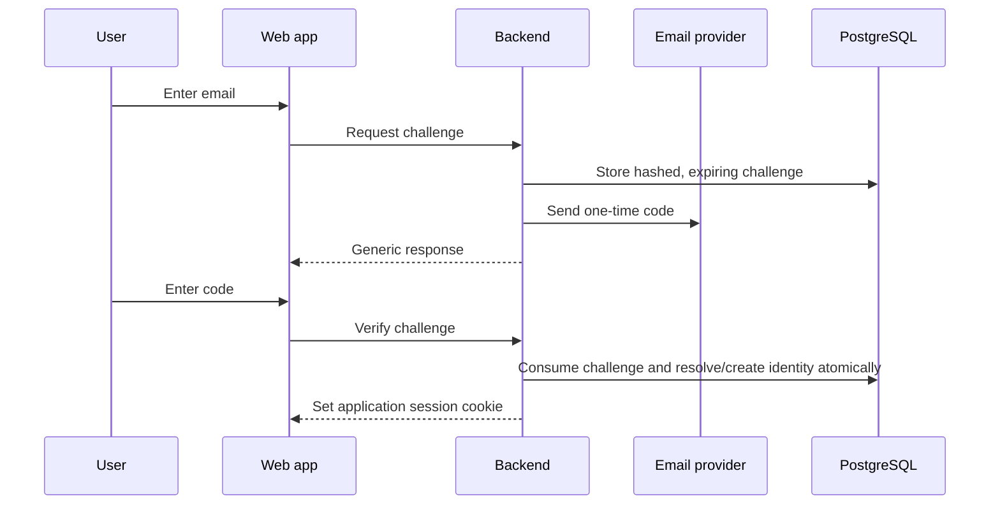
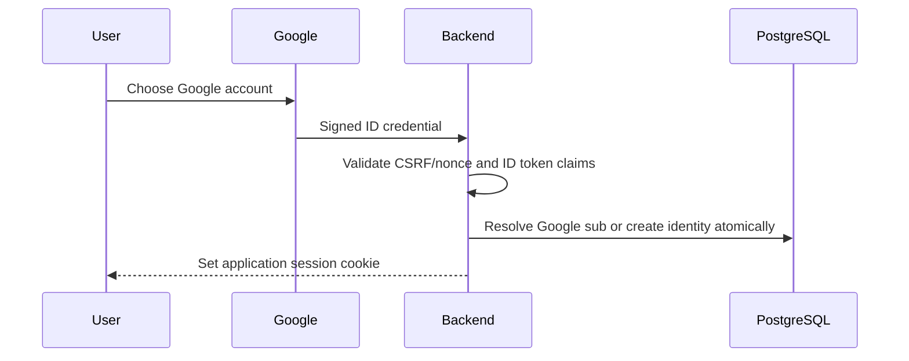
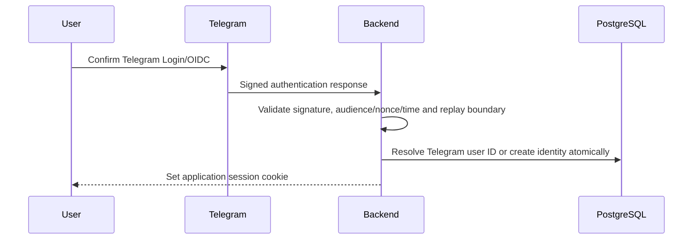
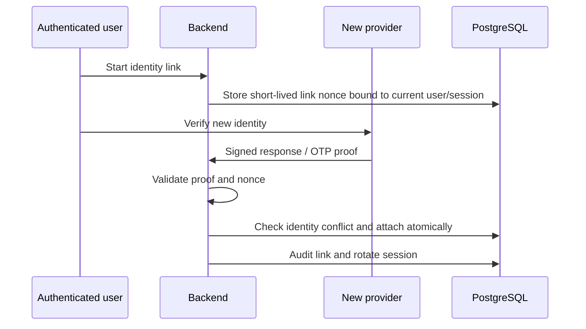

# Auth Flow and Account Linking v1

- Status: **accepted workflow contract**
- Date: **2026-08-02**
- Scope: registration, login, linking, logout and onboarding handoff

## 1. Entry Surface

The first-MVP login surface offers three equivalent identity entry points:

```text
Continue with Google
Continue with Telegram
or
Continue with email
```

No provider decides whether the user is a trainer or athlete. After authentication, the backend routes the user according to canonical capabilities and onboarding state.

## 2. Email OTP Flow



Failure states: invalid, expired, consumed, attempt limit, resend limit and delivery unavailable. All failures preserve a safe retry or alternate-provider path.

## 3. Google Flow



Google authentication never grants Google API access unless a later feature introduces a separate authorization consent flow.

## 4. Telegram Flow



If Telegram Login is unavailable in the current environment, the UI preserves email and Google fallback. A bot deep link may be used for explicit account linking after its nonce contract is implemented.

## 5. New User Handoff

After the first verified identity:

1. Create one internal user and identity in one transaction.
2. Ask only for missing display/profile information.
3. Resolve capability onboarding:
   - existing invited athlete accepts the invitation and gains `AthleteProfile` plus relation;
   - trainer activation policy follows the B0 open-decision register;
   - dual capability remains supported by the domain model.
4. Route to canonical trainer or client home only after capability is proven.

## 6. Existing Email Collision

When Google or another provider returns an email matching an existing email identity but the provider subject is new:

- do not create an automatic merge;
- do not reveal unnecessary account details;
- ask the user to authenticate the existing account;
- after that authentication, repeat fresh provider verification and link explicitly;
- create an audit event for the successful link or rejected conflict.

## 7. Link Provider Flow



## 8. Logout and Revocation

- Logout revokes the current server session and clears the cookie.
- "Logout all devices" revokes all active sessions for the user.
- Account suspension prevents new sessions and invalidates existing sessions.
- Identity unlink does not revoke unrelated identities but rotates active sessions after a sensitive change.
- Provider logout/revocation and product session logout are separate operations; the product must not imply that it signed the user out of Google or Telegram globally.

## 9. Error and Privacy Contract

- Do not expose whether an arbitrary email, Google subject or Telegram ID is registered.
- Do not include provider tokens, codes, full callback URLs or personal payloads in logs.
- Preserve an accessible fallback from popup/webview/provider failures to email OTP.
- Never send workout, discomfort, health-adjacent or payment details inside authentication messages.

