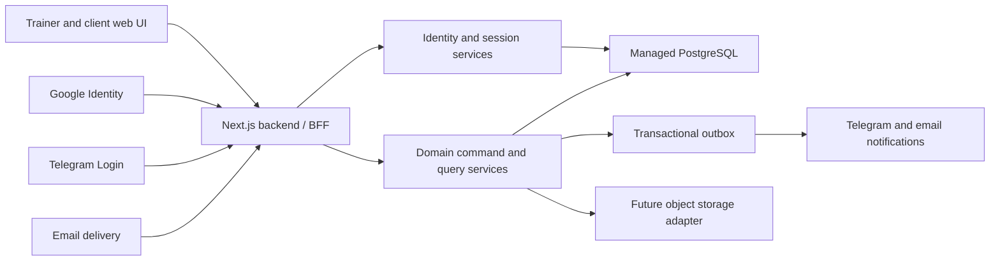

# Backend Foundation B0

- Status: **accepted architecture baseline**
- Date: **2026-08-02**
- Owner: **Founder/Product Lead**
- Scope: architecture and implementation gates only; no application, route, schema or infrastructure changes

## 1. Objective

B0 defines how AI Strength Coach moves from a browser-local pilot runtime to a real multi-user product without making Supabase a product dependency. It fixes the identity, session, authorization and database boundaries required before B1.

## 2. Accepted Decisions

1. PostgreSQL remains the canonical system of record. Existing domain decisions D-061, D-085 and D-092 through D-095 remain valid.
2. Product browsers never connect directly to PostgreSQL and never receive privileged database credentials. UI calls same-origin backend commands and queries.
3. Authentication and product identity are separate. One internal `User` may have multiple verified `AuthIdentity` records.
4. First-MVP identity providers are `email_otp`, `google` and `telegram`.
5. Password authentication is excluded from the first implementation. It may be reconsidered only after an explicit recovery or market requirement.
6. Google and Telegram credentials are verified server-side. Email ownership is verified with a short-lived, single-use challenge.
7. The provider subject is the external identity key: Google `sub`, Telegram stable user ID, and the normalized verified email identity. Display name, username and email are never trusted as cross-provider identity keys.
8. Successful provider verification creates an application-owned opaque session. The browser receives only a `Secure`, `HttpOnly`, `SameSite` cookie; auth tokens are not stored in localStorage or sessionStorage.
9. Auth provider claims do not grant trainer or athlete access. Capabilities come from canonical `TrainerProfile`, `AthleteProfile` and `TrainerAthleteRelation` records.
10. Account linking requires an already authenticated application session plus fresh verification of the new provider. Equal email text alone does not silently merge accounts.
11. Backend commands authorize actor, capability, ownership and relation before data access. PostgreSQL RLS remains defence in depth through application actor context, not Supabase `auth.uid()`.
12. Demo runtime remains available for deterministic research and presentation. It is never migrated automatically or treated as production truth.

## 3. Superseded Stage 4 Decisions

The following decisions are superseded by this B0 baseline:

- D-086: Supabase as the accepted first-beta PostgreSQL provider;
- D-089: clean Supabase staging as the default implementation path;
- D-096: Supabase Auth as the first-beta identity adapter;
- D-097: Supabase Storage as the accepted limited first-beta storage capability;
- D-100: provider reassessment deferred until after beta.

PostgreSQL portability, repository boundaries, server commands, transactional writes, idempotency, audit, provider-neutral media services and the rejection of self-hosted PostgreSQL for first beta remain accepted.

## 4. Target Architecture

The backend-for-frontend is the only ordinary product access path to PostgreSQL. Authentication adapters produce a canonical actor; they do not expose provider tokens to domain code.

## 5. Security Boundary

- Fail closed when session, provider signature, capability, ownership or relation cannot be proven.
- Use generic responses for email challenge requests to reduce account enumeration.
- Challenges and linking nonces are random, hashed at rest, single-use, rate-limited and time-limited.
- Rotate the application session after login, identity linking and capability changes.
- Revoke sessions on explicit logout, account suspension, credential compromise and sensitive identity changes.
- Do not place full email addresses, auth tokens, Telegram payloads, health-adjacent comments or complete callback URLs in logs.
- Notification payloads contain only a generic event and authenticated deep link; the product remains the source of truth for feedback and discomfort details.

## 6. B1 Entry Gate

B1 may start when the following are selected and recorded:

- managed PostgreSQL provider, region, owner and backup policy;
- migration/query tool and connection-pooling strategy;
- development, test and production environment ownership;
- application session lifetime and revocation policy;
- secret storage and rotation owner.

The email delivery provider is required before B2. Google and Telegram production credentials are required before B3, not before B1.

## 7. B1-B4 Delivery Order

| Stage | Deliverable | Acceptance gate |
| --- | --- | --- |
| B1 | Managed PostgreSQL, migrations, connection boundary, `users`, `auth_identities`, `sessions`, audit skeleton | Clean database can migrate up; backend can create/read a synthetic user; no browser DB access |
| B2 | Email OTP registration/login/logout/revocation | New and returning users authenticate without password; replay, expiry and rate-limit tests pass |
| B3 | Google and Telegram adapters plus explicit account linking | Three providers can resolve to one internal user without silent merge |
| B4 | Profiles, capabilities, trainer-client invitations and relation authorization | Trainer sees only related athletes; athlete sees only own records; negative authorization tests pass |

## 8. Non-Goals

- No migration of workout facts in B0.
- No auth UI redesign in B0.
- No provider account creation or secret entry in the repository.
- No password support, social graph import, Gmail access, Google Drive access or Telegram message history access.
- No production notification delivery or file upload in B0-B4.
- No automatic migration from the unknown Supabase remote or browser demo state.

## 9. B0 Completion

B0 is complete when this baseline, the identity model, auth flows, open-decision register and decision-log supersessions are internally consistent. Infrastructure selection remains an explicit B1 prerequisite rather than an undocumented assumption.

