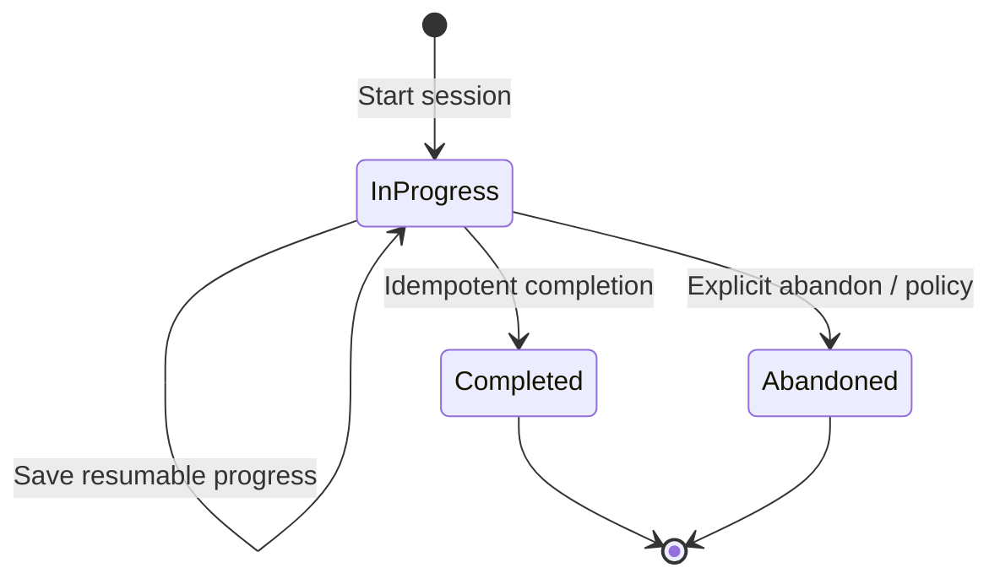
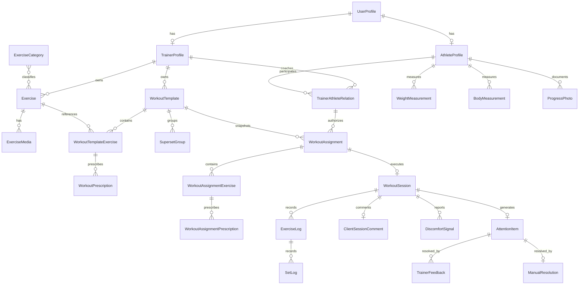

# Canonical Domain Model v1

Status: accepted working domain model for the first MVP. This is a conceptual model, not a SQL specification; final SQL names, types and enums remain Stage 4/schema decisions.

## Scope and evidence rules

The first vertical MVP is:

`WorkoutTemplate -> WorkoutAssignment snapshot -> WorkoutSession -> ExerciseLog / SetLog -> AttentionItem -> TrainerFeedback`

Evidence labels used below:

- **Accepted decision**: confirmed by Stage 2 documents or `docs/decision-log.md`.
- **Migration evidence**: confirmed by a file in `supabase/migrations/`.
- **Code read/write evidence**: confirmed by a current Supabase/API/localStorage call.
- **Prototype/mock evidence**: represented only by demo, mock, or inline state.
- **Inferred**: recommended from the accepted workflow and current constraints.
- **Open question**: cannot be decided safely from the repository.

The accepted workflow takes precedence over conflicting current code. Program Builder is adjacent legacy/product exploration and does not block this vertical slice.

## Canonical identity and identifiers

- Every persisted canonical entity uses an opaque UUID. Demo slugs such as `artem-smirnov` and IDs such as `demo-client-1` are not production identifiers. **Prototype/mock evidence:** `lib/demo-data.ts`, `lib/demo-mode.ts`.
- `auth.users.id` identifies an authenticated account. `UserProfile` is the one-to-one product profile for that account.
- Trainer and athlete are non-exclusive capabilities represented by optional one-to-one extension profiles. One auth user has exactly one UserProfile and may have both TrainerProfile and AthleteProfile.
- `TrainerAthleteRelation.id`, not `profiles.trainer_id`, is the canonical authorization and historical relationship identifier.
- Authorization is determined by authenticated capability, ownership and TrainerAthleteRelation, never only by a string role.

Unless a row explicitly says it is a projection or controlled vocabulary, its durable canonical store is its source of truth and its UUID is the canonical identifier. Foreign/display names, localStorage IDs and dates are never entity identity. Creation triggers and ownership are stated per row; immutable provenance, actor and audit timestamps are retained even when mutable content is archived.

## Entity overview

| Entity | Purpose and owner | Key conceptual fields and relationships | Lifecycle, mutability, deletion | Security and current mapping | MVP / open decisions |
|---|---|---|---|---|---|
| **UserProfile** | Account-level identity; owned by the auth user | `id = auth_user_id`, display name, IANA time zone, locale, contact preferences; optional `TrainerProfile` and `AthleteProfile` | Created after signup; personal fields mutable; identity/audit fields immutable; deactivate rather than cascade-delete history | Private account data. Current `profiles` is overloaded with role, trainer link, payment, public trainer fields, and body values. Base table migration is absent; only ALTER migrations exist in `20250316120000_client_anthropometry.sql` and `20250317100000_client_weight_height_target.sql` | Required; capability-based multi-role identity accepted |
| **TrainerProfile** | Trainer capability and public professional profile; owned by user | user id, public slug, bio, specialization, public visibility | Created when trainer capability is granted; public fields mutable; archive capability without deleting history | Owner writes; public reads only an explicit public projection. Current trainer fields live in `profiles`; `/t/[slug]` reads a public profile | Required optional capability; provisioning is an implementation workflow |
| **AthleteProfile** | Coaching/person profile for a user acting as athlete; owned by user | user id, goals and coaching-relevant preferences; measurements remain separate facts | Created on athlete onboarding; athlete edits self-described fields; trainer may edit only explicitly delegated coaching fields; archive, do not destroy records | Athlete reads own; active trainer relation grants scoped read. Current client identity is duplicated across `profiles`, `trainer_clients`, and mock `AthleteProfile` in `components/trainer-os/client-profile/types.ts` | Required optional capability extension |
| **TrainerAthleteRelation** | Sole canonical coaching connection; jointly established, operationally managed by trainer | trainer id, athlete id, primary marker, conceptual state (`invited`, `active`, `ended`), invited/accepted/ended timestamps, access scope | A trainer has many relations; an athlete retains history across trainers but has at most one active primary trainer in first MVP. Ending revokes access to new data and preserves history | Every trainer access to athlete-private data checks capability plus relation. `profiles.trainer_id` is not target model. Current code alternates between it and `trainer_clients` | Required. Historical trainer access after relation end remains proposed; enum names are not SQL contract |
| **ExerciseCategory** | Controlled classification for discovery/filtering | stable id/key, label, hierarchy/order | Curated; archive instead of deleting referenced categories | Generally readable; admin/system managed | Useful controlled vocabulary; physical normalization is an implementation choice |
| **Exercise** | Reusable movement definition; system-owned or trainer-owned | owner kind, owner trainer when custom, title, description, categories, equipment, visibility, source exercise | System exercises immutable to trainers; trainer copy/custom exercise editable by owner; archive if referenced | Authenticated users see system plus their own exercises in first MVP. `exercise_library` migration: `20260402120000_exercise_library.sql`; seeded/extended by `20260402143000_seed_system_exercise_library.sql`; legacy fallback remains | Required; cross-trainer custom sharing is later |
| **ExerciseMedia** | Optional media references for an exercise | exercise id, media kind, URL/storage object, order, accessibility metadata | Replace/archive media independently; preserve reference metadata for used snapshots where needed | Follows exercise visibility; signed access for private media | Supporting. A single URL can be temporary default |
| **WorkoutTemplate** | Trainer-owned reusable workout definition with revisions | trainer id, title, mutable draft revision, immutable published revisions, metadata; ordered `WorkoutTemplateExercise` children | Draft revision is mutable. Publishing freezes that revision; substantial edits create a new revision. Archive preserves revisions and historical assignments | Owner trainer writes. Current `trainer_builder_templates` stores builder JSON in `exercises` (`20260404120000_trainer_builder_templates.sql`); `workout_templates` is also used as a program object but has no migration in repo | Required; immutable published revision model accepted |
| **WorkoutTemplateExercise** | Ordered exercise instance inside a template | template revision id, exercise id, instance id, order, notes, optional superset group | Mutable only with editable template revision; instance id stable inside revision | Inherits template ownership | Required |
| **WorkoutPrescription** | Prescribed work for a template exercise | required sets and repetitions or repetition range; optional target weight, rest, trainer note and duration | Mutable in draft; copied to assignment snapshot. Distance, pace, calories, complex intervals, percentage loading, automatic formulas and advanced periodization are later extensions | Inherits template ownership | Required; narrow extensible MVP scope accepted |
| **WorkoutPrescriptionOverride** | Optional set-level exception | prescription id, stable set instance, set kind (`warmup` or `working` in MVP), overridden values and note | Mutable in draft; copied into snapshot. Advanced techniques use note/overrides for now; broad final enum is not accepted | Inherits template | Supported for hybrid set model |
| **SupersetGroup** | Groups ordered template exercise instances | template revision, group id, explicit member order, 2-4 members | No nesting; an exercise belongs to at most one group; ungroup preserves exercises; group reorder preserves internal order; copied into assignment | Inherits template | Included in MVP; final SQL representation remains open |
| **WorkoutAssignment** | Scheduled, athlete-specific independent snapshot | relation id, athlete/trainer, source template revision, schedule interpreted in athlete time zone, snapshot version/hash, optional archival diagnostic JSON | Created only from a saved template. Normalized exercise/prescription children are source of truth; archival JSON is optional and non-authoritative. Structure locks after session start; archive, never cascade-delete history | Trainer creates for active relation; athlete reads. Current builder assignment is localStorage-only prototype/demo state and is not migrated by default | Required; normalized snapshot accepted |
| **WorkoutAssignmentExercise** | Ordered copied exercise instance | assignment id, source template exercise id, exercise identity/display snapshot, order, superset snapshot | Created atomically with assignment; structural fields immutable once session starts | Same relation scope as assignment | Required |
| **WorkoutAssignmentPrescription** | Copied athlete-specific prescription | assignment exercise id, prescription/set identity and values | Editable before start under trainer rules; immutable after start | Trainer writes before start; athlete never edits prescription | Required |
| **WorkoutSession** | One execution attempt for one assignment | assignment/relation ids, lifecycle, started/completed UTC timestamps, completion idempotency key, athlete time zone context | At most one active/resumable session; explicit client completion is required and partial completion is allowed. Zero-result completion requires confirmation and optional reason. Conceptual completed-with-omissions distinction is allowed; final status enum remains open | Athlete starts/edits own active session; trainer reads via relation. Current client page writes set rows and only notifies completion | Required; completion behavior accepted |
| **ExerciseLog** | Session-level execution fact for one assignment exercise | session id, assignment exercise id, order, skipped/completed/incomplete facts, athlete note/reason | Created during session; skipped exercises are preserved; editable while active; completed facts require explicit audited correction | Athlete writes active session; trainer reads | Required |
| **SetLog** | Atomic factual performed or omitted set | exercise log id, prescription/set instance id, sequence/kind, performed reps/load/duration and completed/skipped/incomplete fact | Stable idempotent upsert while active; no invented result is required; locked at completion except audited correction | Shared source for client and trainer. Current `workout_logs` rows lack confirmed session/stable-set identity | Required |
| **ClientSessionComment** | Athlete's session comment in original wording | session id, text, submitted/updated timestamps | Editable while active; preserved at completion; later correction is versioned/audited | Athlete writes; related trainer reads | Required when supplied |
| **DiscomfortSignal** | Structured factual discomfort report plus original client wording | session/comment/log link, `hasDiscomfort`, optional neutral area/severity, original comment, occurred/reported timestamps | Preserve fact and raw text; clarification does not replace original; no automatic diagnosis or medical conclusion | Sensitive health-adjacent data; least-privilege access. AI cannot hide, diagnose or rewrite it | Required when reported; representation accepted conceptually |
| **AttentionItem** | Durable trainer work item generated from a completed session | owner trainer, relation id, source session id, type, lifecycle status, priority reasons, created/resolved UTC timestamps | Exactly one review item per completed session; persisted rather than computed only on read; opening does not change state; feedback/manual resolution is audited; archive instead of ordinary hard delete | Owner trainer reads/writes; athlete does not access queue internals. Current queues are unrelated mocks/local state; reviews are date-based | Required; final status enum remains open |
| **FeedbackType** | Controlled vocabulary defining feedback behavior | stable conceptual kinds `detailed`, `acknowledgement` and `follow_up`; referenced by TrainerFeedback | Product-controlled; used keys immutable; labels may be localized; final SQL enum names are not fixed | Readable to authenticated clients; not user-created. Current review table has no explicit type | Required vocabulary |
| **TrainerFeedback** | Auditable feedback for a specific session | session, relation, author, type, body/structured payload, draft/sent state, created/sent UTC timestamps | Draft is mutable; sent feedback is append-only/immutable in ordinary flow; correction is follow-up. AI draft is not TrainerFeedback until explicit send. Archive preserves audit history | Trainer creates through authorized relation; athlete reads own; athlete cannot edit | Required; historical access after ended relation remains proposed |
| **ManualResolution** | Audited non-feedback closure of AttentionItem | attention item, trainer, reason, resolved timestamp | Created once when manually resolving; reason required; immutable | Trainer owner only | Required for manual close path |
| **WeightMeasurement** | Point-in-time body weight fact | athlete id, measured-at UTC instant, normalized kg value, optional original value/unit, source | Append facts; corrections audited; current value/trend derived | Athlete writes own; active trainer reads. Current `weight_logs` and duplicated profile weight fields lack complete migration chain | Included when measurements exist; bodyweight trend is derived |
| **BodyMeasurement** | Point-in-time body dimension fact | athlete id, type, UTC instant, normalized cm value, optional original value/unit, source | Append facts; corrections audited | Sensitive; same athlete/relation scope | Adjacent to initial progress scope |
| **ProgressPhoto** | Athlete progress media fact | athlete id, captured/uploaded time, storage reference, visibility/consent | Append/archive with consent and retention controls | Highly sensitive private media; never public by trainer-profile rules | Adjacent, not required for the first workout-review slice |
| **ProgressProjection** | Rebuildable read model for completed history, completion count/consistency, selected-exercise working weight/repetitions/best completed set and optional bodyweight trend | athlete, metric definition/version, source watermark, computed values | Recomputed from WorkoutSession, SetLog and measurements; no composite progress score; can be deleted/rebuilt | Role-filtered projection; source facts govern access | Minimal MVP progress model accepted |
| **InternalTrainerNote** | Trainer-private note about coaching context | relation id, trainer id, body, timestamps | Append/edit with audit policy; archive | Never visible to athlete unless explicitly converted/shared | Adjacent, not required for slice |
| **Notification** | Delivery attempt for domain events | recipient, event/reference, channel, state, attempts | Created after durable domain event; retryable/idempotent | Backend-managed; no service key in browser | Supporting; external beta channel open |
| **Message** | General conversation independent from session feedback | relation, sender, body, status, timestamps | Append; read status mutable | Participants of active/historical relation. Current `trainer_client_messages` migration exists (`20260406120000_trainer_client_messages.sql`) but relationship checks are insufficient | Adjacent, not required for core review feedback |
| **AccessStatus** | Coaching/product entitlement if needed | relation/user, state, reason, effective range | Explicit transitions; should not be inferred from payment row in core workflow | Server-authoritative | Supporting; may initially be a relation field |
| **Subscription** | Commercial billing state | account/customer/provider references, state, period | Provider/webhook managed; immutable event history plus current projection | Financial/private; service backend only | Outside first vertical slice |

## Time, units and archive conventions

- Persist timestamps as UTC instants. UserProfile stores an IANA time zone; assignment calendar dates are interpreted in the athlete's time zone.
- Normalize weight to kilograms and length to centimeters. Presentation units may differ; original entered value/unit may be retained for audit.
- WorkoutTemplate, TrainerAthleteRelation, WorkoutAssignment, WorkoutSession, TrainerFeedback and AttentionItem use archive/soft-delete semantics in ordinary product flow. Historical cascade deletion is forbidden; physical deletion is a separate privacy/admin procedure.
- Program and ProgramAssignment remain outside the first vertical slice. A future Program may orchestrate template revisions and assignments, but current program-oriented tables are not canonical automatically.

## Session state machine

`WorkoutAssignment` owns schedule/cancellation state. A session is created only when execution starts. `Completed` is terminal in the ordinary flow. Any correction after completion is explicit and audited.

In the accepted product chain, **WorkoutLog** is the execution aggregate exposed by read models: one `WorkoutSession` with its `ExerciseLog` and `SetLog` facts. It is not an additional independently mutable source of truth. This resolves the conflict between the generic `WorkoutLog` name in `src/types/index.ts` and the row-per-set writes currently made to `workout_logs`.

## ER overview

## Current implementation conflicts

1. `workout_templates` is used as a multi-week program by `app/api/trainer/programs/route.ts`, while the target template is one assignable workout. **Code read/write evidence.**
2. Builder drafts are stored in `trainer_builder_templates.exercises` JSON or localStorage, and assignments are localStorage payloads that can originate from unsaved state. **Migration and code write evidence:** `20260404120000_trainer_builder_templates.sql`, builder components.
3. Client completion writes independent `workout_logs` rows and sends a notification; it does not persist a `WorkoutSession` state transition. **Code write evidence:** `app/(client)/client/[id]/page.tsx`, `app/api/notify-complete/route.ts`.
4. `trainer_workout_reviews` identifies reviews by trainer/client/date, not session. **Migration evidence:** `20260403120000_trainer_workout_reviews.sql`.
5. Trainer-athlete authorization alternates between `profiles.trainer_id` and `trainer_clients`; neither base schema is migration-reproducible from this repository. **Code evidence and missing migration evidence.**
6. Progress pages derive and mock different representations. Facts such as `weight_logs` and `workout_logs` have no creation migrations in this repository. **Code read evidence and migration gap.**

## Decision candidates for Product Lead review

| Proposed decision | Alternatives | Recommendation | Rationale | Evidence | Affected entities | Affected existing tables/code | Urgency |
|---|---|---|---|---|---|---|---|
| Permit trainer access to historical shared records after relation end | Revoke all trainer UI access; permanent historical access | Keep proposed pending privacy/legal review; retain records regardless | Product value and privacy expectations conflict | Historical records must survive, but authorization policy is not accepted | Relation, Session, Feedback | Existing trainer/client readers and future RLS | Before schema |
| Include ProgressPhoto in the first vertical slice | Defer; athlete-only | Defer until privacy and beta need are validated | Sensitive media increases storage/consent scope | Current implementation is mock/prototype | ProgressPhoto | Trainer/client progress UI | Before beta |
| Deliver a complete mobile builder in first MVP | Desktop/tablet full builder plus limited mobile; full mobile parity | Keep device scope proposed pending trainer research | Device choice materially changes builder UX, not core facts | Stage 2 working hypothesis only | Template authoring entities | Builder UI | Before UX implementation |
