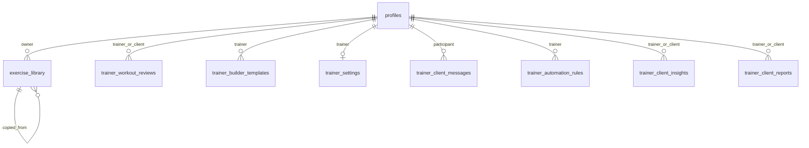

# PostgreSQL Remote Schema Inventory v1

Status: read-only audit. The configured remote is classified as **unknown legacy environment**. It is not operational source of truth or beta-ready; local evidence is not presented as remote fact.

## 1. Environment identity

| Item | Result | Confidence |
|---|---|---|
| Configured Supabase ref | `ntsu...fsgv` (redacted) from `.env.local` | High |
| Number of app-configured refs | One | High |
| CLI link | None: no `supabase/.temp/project-ref`, config, or CLI auth directory | High |
| Project endpoint | DNS `ENOTFOUND`; `supabase.com` DNS/HTTPS succeeded | High |
| Project name / organization / region | Unknown | None |
| Environment class | Unknown; local demo mode is enabled, but that does not identify the database | High for local mode, none for remote class |
| Remote operational source of truth | Not confirmable | Blocker |

No evidence proves that the configured database is development, staging, production, or contains real data. Until recovery, it must not receive new migrations, canonical schema, beta or production data, or be used for security validation. Clean Supabase staging is the accepted default implementation path.

## 2. Audit method

1. Confirmed Git branch/base and clean tree.
2. Checked installed tooling and local Supabase metadata.
3. Attempted read-only PostgREST OpenAPI GET using credentials only inside the process; DNS failed before HTTP.
4. Inspected all 11 local SQL migrations and all Supabase SDK/API call sites.
5. Performed no SQL, migration, Auth, Storage, environment, link or Dashboard mutation.

Supabase CLI version: unavailable because CLI is not installed. No unfamiliar CLI command was executed.

## 3. Limitations

- No `information_schema`, `pg_catalog`, remote schema dump or migration-history access.
- Remote schemas, objects, exact/estimated counts, columns, constraints, indexes, RLS, policies, functions and triggers are unknown.
- All object details below are **local migration evidence** or **code expectation**, not proof of remote existence.
- No rows or personal values were retrieved.

## 4. Schemas

| Schema | Ownership / purpose | Application use | Portability relevance | Remote status |
|---|---|---|---|---|
| `public` | Application objects in local SQL and PostgREST code | Direct | Core | Unknown |
| `auth` | Supabase Auth, referenced by `auth.uid()` and SDK | Authentication/RLS | Must be replaced or adapted if Auth changes | Unknown |
| `storage` | Supabase Storage expected for `logos` bucket | Trainer public logo | Replaceable by S3-compatible storage | Unknown |
| `supabase_migrations` | Expected CLI migration history | Audit only | Needed for reconciliation | Unknown |
| Other system schemas | PostgreSQL/Supabase internals | Not directly used by app code | Exclude from application baseline | Unknown |

## 5. Application tables: local migration evidence

All eight locally created tables use UUID keys, PostgreSQL-native data types and RLS enabled but not `FORCE ROW LEVEL SECURITY`.

| Table | Columns (type; required/default) | Keys and checks | Explicit indexes | Delete/archive | Local RLS | Remote rows |
|---|---|---|---|---|---|---|
| `exercise_library` | `id uuid`; `title text`; `muscle_group text`; equipment/difficulty/description/video URL text; system/owner/source fields; timestamps; later text arrays for technique/tips/muscles | PK; FK owner -> missing-baseline `profiles`; self FK source; owner/system check | owner, system/title, source | Owner FK cascade; source set null; no archive | 4 policies | Unknown; migration contains seed inserts |
| `trainer_workout_reviews` | UUID id/trainer/client; workout date; status/comment; reviewed/seen/timestamps | PK; two profile FKs; status check; unique trainer/client/date | trainer/date, client/date | Profile cascade; hard-delete policy; no archive | 4 policies | Unknown |
| `trainer_builder_templates` | UUID id/trainer; title/type/note; `exercises jsonb`; timestamps | PK; trainer profile FK | trainer/updated | Profile cascade; hard-delete policy; no revisions/archive | 4 policies | Unknown |
| `trainer_settings` | trainer UUID PK; profile/storefront/notifications/operations/security JSONB; timestamps | PK/FK profile | PK only implicit | Profile cascade; no delete policy/archive | 3 policies | Unknown |
| `trainer_client_messages` | UUID id/trainer/client; sender role/body/status/metadata; created/read timestamps | PK; profile FKs; sender/status checks | thread/date, client/date | Profile cascade; no archive | 5 policies | Unknown |
| `trainer_automation_rules` | UUID id/trainer; trigger/channel/status/audience/message/metadata; counters/timestamps | PK; profile FK; channel/status/rate checks | trainer/status/date | Profile cascade; hard-delete policy | 4 policies | Unknown |
| `trainer_client_insights` | UUID id/trainer/nullable client; scores/segment/tone/driver/action/metrics/timestamps | PK; profile FKs; range/segment/tone checks | trainer/date, client/date | Profile cascade; no archive | 3 policies | Unknown |
| `trainer_client_reports` | UUID id/trainer/client; status/title/period/summary; JSONB sections; timestamps | PK; profile FKs; status check | trainer/status/date, client/date | Profile cascade; hard-delete policy | 5 policies | Unknown |

## 6. Code-expected tables without CREATE migration

| Table | Expected purpose / selected or written fields | Remote status | Source-of-truth risk |
|---|---|---|---|
| `profiles` | identity, role, trainer link, public trainer fields, body values, payment/access, Telegram | Unknown; two local ALTER-only migrations | Critical overloaded missing baseline |
| `trainer_clients` | trainer/client link, status, access flag | Unknown | Conflicts with canonical relation and `profiles.trainer_id` |
| `exercises` | legacy trainer exercise library | Unknown | Fallback source only |
| `workout_templates` | program/template JSON, weeks, price/public/media metadata | Unknown | Overloaded Program/template concept |
| `assigned_programs` | client/template/status assignment | Unknown | No snapshot/session semantics |
| `client_programs` | purchased/access program | Unknown | Entitlement conflated with assignment |
| `workout_logs` | client/template/exercise instance, performed weight/reps, completion/time | Unknown | Flat facts without canonical session/set identity |
| `weight_logs` | client, weight, timestamp | Unknown | Potential WeightMeasurement source |
| `payments` | trainer/client amount/category/time | Unknown | Browser-written financial data |

`logos` is a Supabase Storage bucket reference, not proven to be a PostgreSQL application table.

## 7. Indexes and constraints

Local SQL defines 13 named secondary indexes, eight primary keys, multiple profile FKs, one self-FK, one unique review constraint and text/range checks. Actual remote indexes and implicit indexes are unknown. No local migration creates the referenced `profiles` baseline.

## 8. Functions

| Function | Purpose | Security | Supabase coupling | Risk / remote status |
|---|---|---|---|---|
| `set_exercise_library_updated_at()` | Trigger timestamp | Invoker/default; no explicit search path | None | Low; remote unknown |
| `copy_system_exercise_to_my_library(uuid)` | Copy system exercise for current user | `SECURITY DEFINER`; `search_path=public`; grant to `authenticated` | `auth.uid()`, Supabase role | Medium; review owner/search path; remote unknown |
| `set_trainer_workout_reviews_updated_at()` | Trigger timestamp | Invoker/default | None | Low; remote unknown |
| `mark_trainer_workout_review_seen(date)` | Mark client-visible review seen | `SECURITY DEFINER`; `search_path=public`; grant to `authenticated` | `auth.uid()`, Supabase role | High: date source can match multiple trainer rows; remote unknown |
| `set_trainer_builder_templates_updated_at()` | Trigger timestamp | Invoker/default | None | Low; remote unknown |
| `set_trainer_settings_updated_at()` | Trigger timestamp | Invoker/default | None | Low; remote unknown |

Local unique functions: 6 (7 definitions because copy function is replaced in the seed migration). No local profile creation, relation linking, completion, attention, notification or payment DB function exists.

## 9. Triggers

Four local `BEFORE UPDATE` triggers set `updated_at` on exercise library, reviews, builder templates and settings. Remote triggers are unknown.

## 10. RLS and policies

Local evidence: 8 tables enabled for RLS, 32 policies, zero `FORCE RLS`. Policies rely on `auth.uid()`; many omit an explicit `TO authenticated`. Policies for reviews depend on `profiles.trainer_id`; messages/insights/reports do not prove trainer-client relation. Remote policy state is unknown.

## 11. Aggregated row counts

All remote counts are **unknown** because the endpoint cannot be resolved. A nonzero count alone would not prove production data. Unknown rows are never migrated automatically; localStorage remains prototype/demo. If the old project is found, it remains read-only until an explicit data decision. Deletion of the old project is not in the next stages.

## 12. Local-evidence ER overview

## 13. Evidence confidence

- High: files, code call sites, local object counts, configured-ref count, DNS failure.
- Medium: intended effects of unapplied local SQL.
- None: remote existence, remote migration application, counts, project identity/region, real-data classification.

## 14. Unknowns

Remote catalog/history, Auth users/counts, Storage buckets/policies, Realtime publications, extensions, privileges, owners, grants, FORCE RLS, manual Dashboard changes, environment class and row provenance.

## Decision candidates for Product Lead review

| Candidate | Recommendation | Evidence needed | Urgency |
|---|---|---|---|
| Recover old remote after clean staging | Proposed only if the founder confirms existence, access, valuable real data, clear purpose and safe auditability | Founder/manual verification | Later or before exceptional data migration |
| ProgressPhoto Storage target | Keep proposed | Privacy/product scope and bucket audit | Before sensitive-media implementation |
| Direct browser read allowlist | Keep proposed | Canonical RLS/read-model tests | Before beta |
