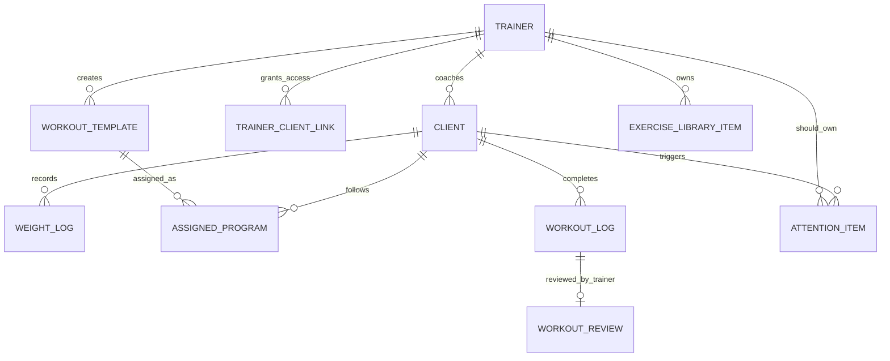

# Trainer Audit Raw Answers

Дата: 2026-06-18

Этот документ - простая сборка последних восьми аудиторских ответов по тренерскому кабинету.

Здесь не пересобрана структура продукта и не создан новый план. Это архив ответов подряд, чтобы вся информация была в одном месте.

---

## Ответ 1. Senior Product Designer / UX Architect Audit

### Executive Summary

Текущий тренерский кабинет уже двигается в сторону правильного продукта для премиального онлайн-тренера, но пока в нем одновременно живут несколько разных логик:

- coaching operating system;
- CRM;
- BI dashboard;
- program marketplace;
- automation/admin tool.

Для тренера с 10-30 активными клиентами главный объект должен быть не график, не программа и не аналитика, а клиент.

Правильный рабочий цикл:

```text
Client -> Attention Item -> Action -> Next Client
```

Сейчас часть экранов поддерживает этот цикл, но часть экранов размывает его.

Главный риск: продукт становится широкой админкой, а не ежедневным рабочим центром тренера.

### Critical Issues

| Severity | Screen | Issue | Explanation | Recommended Redesign |
|---|---|---|---|---|
| Critical | `/trainer/dashboard` | Dashboard частично конкурирует с Attention Center | Dashboard, Attention, Calendar и Insights отвечают на похожий вопрос: "что требует внимания?" | Dashboard должен быть главным client route board: клиент, статус тренировки, нужен ли разбор, что назначить дальше |
| Critical | `/trainer/attention` | Attention Item не является реальной системной сущностью | Экран есть, но сущность пока не является единым источником правды | Создать persisted `attention_items`, от которых питаются Dashboard, Clients, Calendar, Review |
| Critical | Quick Assign | Quick Assign не глобальный | Лучший workflow назначения живет только в Dashboard | Вынести Quick Assign в shared drawer/provider и вызывать из всех контекстов |
| Critical | `/trainer/clients/[clientId]` | Client Profile перегружен информацией | Карточка клиента должна помогать решить, что делать сейчас, а не просто показывать все данные | Верх карточки: Current State, Open Attention Items, Next Action |
| Critical | Navigation | Слишком много top-level разделов | Тренеру нужно работать, а не выбирать между 12 разделами | MVP-nav: Главная, Клиенты, Внимание, Шаблоны, Календарь, Библиотека, Настройки |

### Medium Issues

| Severity | Screen | Issue | Explanation | Recommended Redesign |
|---|---|---|---|---|
| Medium | `/trainer/programs` | Programs слишком важны в навигации | В operating model templates primary, programs secondary | Перенести фокус на шаблоны, программы сделать циклом/группой шаблонов |
| Medium | `/trainer/insights` | Экран похож на BI | Для MVP это не рабочий экран тренера | Спрятать из основной навигации, выводить инсайты как Attention Items |
| Medium | `/trainer/sales` | Sales конкурирует с coaching | Для премиального тренера деньги не должны быть в основном рабочем потоке | Оставить в secondary/admin area |
| Medium | `/trainer/messages` | Сообщения могут дублировать Attention | Если реальная коммуникация в Telegram, отдельный inbox может быть лишним | Сделать сообщения контекстным действием: написать/скопировать/отправить |
| Medium | `/trainer/calendar` | Calendar может стать еще одним task inbox | Календарь должен показывать ритм недели, а не заменять Attention | Оставить как weekly rhythm board |

### Low Priority Improvements

| Area | Improvement |
|---|---|
| Visual density | Сделать рабочие списки плотнее, меньше декоративных карточек |
| Empty states | Добавить пустые состояния, которые ведут к действию |
| Labels | Использовать action-oriented labels вместо абстрактных метрик |
| Mobile | Проверить, что тренер может быстро открыть клиента и назначить тренировку с телефона |
| Search | Глобальный поиск должен искать клиента и сразу давать action |

### Product Architecture Recommendations

1. Сделать `/trainer/*` единственным каноническим тренерским кабинетом.
2. `/dashboard/*` считать legacy и редиректить/прятать.
3. Ввести persisted `AttentionItem`.
4. Ввести real `WorkoutAssignment`.
5. Сделать Quick Assign глобальным.
6. Сделать Templates основным рабочим объектом назначения.
7. Programs оставить вторичной сущностью: bundle/cycle of templates.
8. Спрятать Sales, Insights, Reports, Automation из MVP navigation.

---

## Ответ 2. Full Coach Workday Simulation

### Morning Login

**Current Flow**

Тренер открывает приложение и видит несколько возможных стартовых точек:

- Dashboard;
- Attention;
- Clients;
- Calendar;
- Insights;
- Messages.

**Problem**

Слишком много экранов отвечают на один и тот же вопрос: "что мне делать первым?"

**Impact on Coach**

Тренер тратит внимание на выбор раздела, а не на работу с клиентами.

**Suggested Improvement**

Сделать Dashboard главным route board:

```text
Client | Today workout | Next workout | Waiting review | Status | Action
```

### Reviewing Completed Workouts

**Current Flow**

```text
Dashboard / Clients / Calendar
-> Workout Review
-> Client Profile или назад
```

**Problem**

Workout Review есть, но он не замыкает единый системный task loop. Нет гарантии, что после review задача закрывается везде.

**Impact on Coach**

Тренер может разобрать тренировку, но задача может продолжать жить на других экранах.

**Suggested Improvement**

После "Отметить разобранной":

```text
review.status = reviewed
attention_item.status = done
remove from dashboard review queue
suggest next client
```

### Assigning New Workouts

**Current Flow**

На Dashboard есть Quick Assign. В других местах тренер часто попадает в Builder или Programs.

**Problem**

Лучший быстрый сценарий доступен не везде.

**Impact on Coach**

Назначение из клиента, календаря или attention item становится медленнее.

**Suggested Improvement**

Quick Assign должен открываться из:

- Dashboard;
- Clients roster;
- Client Profile;
- Attention;
- Calendar;
- Review screen.

### Opening Client Profiles

**Current Flow**

```text
Clients -> Client Profile
```

Карточка клиента содержит много блоков: overview, workouts, reviews, metrics, notes, activity.

**Problem**

Контекст есть, но не всегда ясно, что делать следующим.

**Impact on Coach**

Тренер открывает клиента и снова анализирует страницу вручную.

**Suggested Improvement**

Верх карточки клиента:

```text
Current State
Open Attention Items
Next Workout
Last Workout
Main Action
```

### Reviewing History

**Current Flow**

История тренировок и веса есть в разных местах.

**Problem**

Previous loads не всегда видны там, где тренер принимает решение.

**Impact on Coach**

Тренеру приходится переходить между screens, чтобы вспомнить последние веса.

**Suggested Improvement**

Previous loads должны быть inline в:

- Quick Assign;
- Workout Review;
- Builder;
- Client Profile.

### Creating Or Editing Templates

**Current Flow**

Builder поддерживает шаблоны, но Programs визуально и навигационно важнее.

**Problem**

Operating model говорит: Templates primary, Programs secondary.

**Impact on Coach**

Тренер начинает мыслить большими программами, хотя ежедневная работа чаще требует быстро назначить следующий тренировочный день.

**Suggested Improvement**

Основной workflow:

```text
Template -> Quick Assign -> Adjust loads -> Assign
```

Builder - advanced editor, а не дефолтный путь назначения.

---

## Ответ 3. Quick Assign Workflow Audit

### Goal

Тренер должен назначить следующую тренировку клиенту меньше чем за 60 секунд.

### Current Evaluation

| Area | Current State | Problem |
|---|---|---|
| Number of clicks | На Dashboard сценарий приемлемый, но вне Dashboard кликов больше | Quick Assign не глобальный |
| Context switching | Dashboard сохраняет контекст, другие экраны ведут в Builder/Programs | Тренер теряет клиента |
| Workout history | Частично есть через previous loads/history | Нет единого источника |
| Previous loads | Видны в Quick Assign, но не системно везде | Нужно сделать canonical |
| Template selection | Есть в Dashboard Quick Assign | Не связано с общей template library |
| Weight adjustment | Есть быстрые изменения | Хорошая база, но нужно добавить стратегии |
| Confirmation flow | Есть assign / assign and next | Не закрывает real Attention Item |

### What Prevents Fast Assignment

1. Quick Assign доступен только на Dashboard.
2. В других местах назначение ведет в Builder.
3. Нет persisted `WorkoutAssignment`.
4. Нет canonical `AttentionItem`, который закрывается после назначения.
5. Templates не являются единым source of truth.
6. Programs слишком часто выступают как основной объект.
7. Previous loads не везде видны в момент принятия решения.

### Redesigned Quick Assign Flow

```text
Open client/action
-> Quick Assign drawer opens
-> Recommended template preselected
-> Previous loads visible inline
-> Coach chooses load strategy
-> Assign
-> Attention Item closes
-> Next client opens
```

### Target Interaction Count

```text
3-5 actions
```

### Recommended Quick Assign UI

Top context:

```text
Client name
Goal
Current program/cycle
Last workout
Last activity
```

Main choices:

- Assign recommended;
- Repeat last;
- Choose template.

Load strategies:

- Repeat last loads;
- Progress +2.5 kg;
- Progress +5 kg;
- Deload;
- Technique day.

Footer:

- Assign;
- Assign and next;
- Advanced edit in Builder.

---

## Ответ 4. Screen And Entity Map

### Trainer App Tree

```text
Trainer App
├─ Dashboard
│  ├─ Client route board
│  ├─ Need Assignment
│  ├─ Waiting Review
│  └─ Quick Assign Drawer
│
├─ Attention
│  ├─ Attention Queue
│  ├─ Filters
│  └─ Selected Item Context
│
├─ Clients
│  ├─ Client Roster
│  ├─ Attention Feed
│  ├─ Invite Client Drawer
│  ├─ Add Client Drawer
│  ├─ Message Client Drawer
│  └─ Client Actions Drawer
│
├─ Client Profile
│  ├─ Overview
│  ├─ Workouts
│  ├─ Reviews
│  ├─ Metrics
│  ├─ Notes
│  └─ Actions
│
├─ Review
│  ├─ Client Context
│  ├─ Workout Summary
│  ├─ Planned vs Actual
│  ├─ Exercise Review
│  └─ Coach Comment
│
├─ Builder
│  ├─ Client Context
│  ├─ Program Structure
│  ├─ Workout Canvas
│  ├─ Exercise Library
│  └─ Save/Assign Flow
│
├─ Programs
│  ├─ Program Library
│  ├─ Assigned Programs
│  ├─ Templates
│  └─ Assign Program Drawer
│
├─ Calendar
│  ├─ Week Timeline
│  ├─ Today Panel
│  ├─ Upcoming Risks
│  └─ Event Drawer
│
├─ Library
│  ├─ Exercise Library
│  └─ Exercise Detail Sheet
│
├─ Messages
├─ Reports
├─ Automation
├─ Insights
├─ Sales
└─ Settings
```

### Entity Map

Core:

- Client;
- Trainer;
- Trainer Client Link;
- Attention Item;
- Workout Template;
- Program;
- Workout Assignment;
- Workout;
- Workout Log;
- Workout Review;
- Exercise Library Item;
- Weight Log.

Secondary:

- Message;
- Report;
- Insight;
- Automation Rule;
- Payment;
- Sales Product;
- Program Purchase;
- Trainer Settings.

### What Duplicates

| Area | Duplicate |
|---|---|
| Dashboard | `/trainer/dashboard` and `/dashboard` |
| Client Profile | `/trainer/clients/[clientId]` and `/dashboard/clients/[id]` |
| Programs | `/trainer/programs` and `/dashboard/programs` |
| Builder | `/trainer/builder` and `/dashboard/programs/[id]` |
| Library | `/trainer/library` and `/dashboard/library` |
| Settings | `/trainer/settings` and `/settings` |

### What Can Be Removed Or Hidden

Likely 20-30% of screens are not needed for MVP:

- `/trainer/insights`;
- `/trainer/sales`;
- `/trainer/automation`;
- `/trainer/reports`;
- legacy `/dashboard/*`;
- redirect-only client routes.

---

## Ответ 5. Complete Product Architecture Map

### Route Map

Public/Auth:

```text
/
/landing
/login
/signup
/trainers
/t/[slug]
/support
/terms
```

Client:

```text
/client/me
/client/settings
/client/library
/client/dashboard
/client/workouts
/client/activity
/client/progress
/client/[id]
/client/[id]/program/[programId]
/check-in
/history
/profile
/programs
/today
/today/select
/workout/free
/explore
/explore/[id]
```

Trainer:

```text
/trainer/dashboard
/trainer/attention
/trainer/clients
/trainer/clients/[clientId]
/trainer/review/[workoutId]
/trainer/builder
/trainer/programs
/trainer/calendar
/trainer/library
/trainer/messages
/trainer/reports
/trainer/automation
/trainer/insights
/trainer/sales
/trainer/settings
```

Legacy Admin/Trainer:

```text
/dashboard
/dashboard/analytics
/dashboard/clients/[id]
/dashboard/library
/dashboard/programs
/dashboard/programs/[id]
/dashboard/subscribe
/settings
/programs/[id]
```

### Screen Inventory

Trainer critical:

- Dashboard;
- Clients;
- Client Profile;
- Attention;
- Workout Review;
- Builder;
- Library;
- Calendar.

Trainer secondary:

- Programs;
- Messages;
- Reports;
- Automation;
- Insights;
- Sales;
- Settings.

Client critical:

- Client Home;
- Workout Execution;
- Check-in;
- History;
- Programs;
- Settings;
- Library.

### Component Inventory

Trainer:

- `TrainerShell`;
- `ExerciseDetailSheet`;
- `ExerciseLibraryPanel`;
- `WorkoutExerciseCard`;
- `QuickAssignDrawer`;
- `EventDrawerContent`;
- client invite/add/filter/message/action sheets.

Client:

- `MobileCabinetNav`;
- `WeightTracker`;
- `ShareCard`;
- demo client components;
- dashboard cards.

UI:

- button;
- input;
- textarea;
- sheet;
- dialog;
- command;
- tabs;
- badge;
- avatar;
- tooltip.

### Entity Model

Canonical MVP:

- Profile/User;
- Trainer;
- Client;
- TrainerClientLink;
- WorkoutTemplate;
- ProgramPlan;
- AssignedProgram;
- WorkoutAssignment;
- Workout;
- WorkoutLog;
- WorkoutReview;
- ExerciseLibraryItem;
- WeightLog;
- AttentionItem;
- TrainerSettings.

Secondary:

- Message;
- Report;
- Insight;
- AutomationRule;
- Payment;
- Product;
- Purchase;
- Subscription.

### Navigation Structure

Current trainer nav:

```text
Dashboard
Attention
Clients
Messages
Programs
Builder
Calendar
Automation
Insights
Reports
Library
Sales
```

Recommended MVP nav:

```text
Главная
Клиенты
Внимание
Шаблоны
Календарь
Библиотека
Настройки
```

Contextual:

```text
Builder
Programs
Messages
Reports
Sales
Automation
Insights
```

### Potential Duplicates

- New trainer app and old admin dashboard;
- Multiple client route aliases;
- Programs/templates/builders duplicated;
- Analytics/insights/reporting overlap;
- Calendar/Attention/Dashboard all surfacing tasks.

### Dead Screens

- `/client/dashboard`;
- `/client/workouts` outside demo mode;
- `/client/activity` outside demo mode;
- `/client/progress` outside demo mode;
- `/today`;
- `/today/select`;
- `/dashboard/subscribe`.

### Unused Components

Likely unused:

- `components/trainer/workout-form-header.tsx`;
- `components/BackgroundShader.tsx`;
- demo-only components are not core product.

### MVP-Critical Components

- `TrainerShell`;
- Global Quick Assign;
- `ExerciseDetailSheet`;
- `ExerciseLibraryPanel`;
- `WorkoutExerciseCard`;
- Client roster rows;
- Attention item rows;
- Workout review exercise rows;
- Client profile current-state module.

---

## Ответ 6. Entity Relationship Report

### Executive Summary

The core MVP entity model should be:



Biggest architectural gap:

```text
Attention Item is the main product object, but it is not yet a persisted entity.
```

### Core MVP Entities

| Entity | Purpose | Fields | Relationships | Where used | MVP |
|---|---|---|---|---|---|
| Profile/User | Single identity record for trainer/client/admin | `id`, `role`, `full_name`, `email`, `display_name`, `team_logo_url`, `slug`, `is_public`, `telegram_id`, `telegram_link`, `trainer_id`, `weight`, `height`, `target_weight`, `is_paid`, timestamps | Trainer and Client are profile roles | Login, signup, public trainer page, client cabinet, trainer clients, settings | Critical |
| Trainer | Premium coach using trainer OS | Profile fields + public storefront fields | Has many clients, programs, exercises, messages, reviews, reports, settings | `/trainer/*`, `/dashboard/*`, `/trainers`, `/t/[slug]` | Critical |
| Client | Main object of the system | `id`, `full_name`, `email`, `trainer_id`, `weight`, `height`, `target_weight`, `telegram_id`, timestamps | Belongs to trainer; has logs, programs, reviews, messages, reports, attention items | `/trainer/clients`, `/client/me`, `/check-in` | Critical |
| Trainer Client Link | Explicit access/control relationship | `trainer_id`, `client_id`, `access_granted` | Connects trainer and client | Client detail, legacy dashboard, link APIs | Critical |
| Workout Template / Program | Reusable training structure | `id`, `trainer_id`, `title`, `description`, `weeks`, `price`, `is_public`, `difficulty`, `goal`, `cover_url`, `status`, `plan_json` | Created by trainer, assigned to clients | Programs, builder, client program pages | Critical |
| Program Plan JSON | Nested structure inside workout template | `weeks[]`, `days[]`, `exercises[]` with targets | Belongs to workout template | Builder, client workout screen | Critical |
| Assigned Program | Program/template assigned to client | `id`, `client_id`, `template_id`, `status`, maybe `start_date`, timestamps | Client follows template/program | Trainer clients, programs, client home | Critical |
| Workout Log | Actual performed exercise data | `client_id`, `template_id`, `exercise_id`, `performed_weight`, `performed_reps`, `completed`, `created_at` | Belongs to client and exercise/template | Workout execution, history, review logic | Critical |
| Workout Review | Trainer review/comment | `trainer_id`, `client_id`, `workout_date`, `status`, `comment`, `reviewed_at`, `client_seen_at` | Trainer reviews client workout | Review page, client dashboard, client profile | Critical |
| Weight Log | Client measurement history | `id`, `client_id`, `weight`, `created_at` | Belongs to client | Check-in, WeightTracker, client/trainer profile | Critical |

### Coaching Operations Entities

| Entity | Purpose | Fields | Relationships | Where used | MVP |
|---|---|---|---|---|---|
| Attention Item | Core task object | `id`, `client`, `clientId`, `category`, `reason`, `detail`, `priority`, `status`, `dateLabel`, `createdBy`, actions, context | Should belong to trainer/client and source object | Dashboard, Attention, Clients, Calendar | Critical, missing DB |
| Calendar Event | Derived coaching rhythm item | `id`, `day`, `clientId`, `kind`, `title`, `status`, `context`, `href`, `actionLabel` | Derived from assignments/reviews/check-ins | Calendar | Important |
| Upcoming Risk | Future problem prediction | `id`, `inLabel`, `client`, `title`, `context`, `href` | Derived from client/program/workout state | Calendar/Dashboard conceptually | Important |
| Quick Assign Draft | Temporary assignment workspace | selected client/template/load draft | Uses client, template, exercise history | Dashboard Quick Assign | Critical workflow |
| Builder Template | Saved single-day workout template | `trainer_id`, `title`, `training_type`, `note`, `exercises` JSON | Belongs to trainer | Builder | Important |
| Exercise Library Item | Exercise reference | `title`, `muscle_group`, `equipment`, `difficulty`, `description`, `video_url`, `technique_steps`, `tips`, ownership | System or trainer-owned | Library, builder, review | Critical |

### Main Architecture Problems

1. Attention Item must become real.
2. Workout Assignment / Workout Session model is incomplete.
3. Program vs Template vs Product are blurred.
4. Client is correctly the main object, but not all entities point back to Client.
5. InsightAction, AutomationQueueItem, UpcomingRisk, dashboard review/assignment items should collapse into Attention Item.

### MVP-Critical Entity Set

- Profile;
- Trainer;
- Client;
- TrainerClientLink;
- ExerciseLibraryItem;
- WorkoutTemplate / Program;
- WorkoutAssignment;
- Workout;
- WorkoutLog;
- WorkoutReview;
- WeightLog;
- AttentionItem;
- TrainerSettings.

---

## Ответ 7. Trainer Operating Model Alignment

### Alignment Score

```text
58/100
```

The current trainer app is moving in the right direction, especially after the dashboard became more client/workout-route oriented. But the implementation is still split between two mental models:

1. coaching operating system;
2. admin/analytics/program management system.

| Operating Principle | Score | Current State |
|---|---:|---|
| Client-centric | 7/10 | Dashboard and Clients now focus on clients, but Programs/Insights/Sales still pull focus away |
| Attention-driven | 5/10 | Attention Item exists conceptually but is not canonical data |
| Quick Assign first | 5/10 | Strong Quick Assign exists, but only inside dashboard |
| Templates primary | 5/10 | Templates exist in Builder/Quick Assign, but are not primary product object |
| Programs secondary | 3/10 | Programs are still top-level major module |

### Strong Matches

| Area | Why it matches |
|---|---|
| `/trainer/dashboard` | Best-aligned screen right now. It starts from clients, shows next workout status, waiting review, no next workout, and supports Quick Assign |
| Quick Assign drawer | Correct direction: template selection, previous loads, assignment draft, assign and next |
| `/trainer/clients` | Roster direction is right: client list, status, attention state, fast opening |
| `/trainer/review/[workoutId]` | Supports premium coach loop: completed workout -> review -> comment -> close task |
| Exercise library/modal | Good shared object for templates, builder, review, and client experience |

### Weak Matches

| Issue | Type | Explanation | Recommendation |
|---|---|---|---|
| Attention Item is UI-only | Missing model feature | Attention exists as page state/demo concepts, not persisted object | Create real `attention_items` entity |
| Quick Assign is not global | Workflow violation | Best assignment flow lives only inside dashboard | Extract Quick Assign into shared trainer component/provider |
| Templates are buried | Model violation | Templates exist inside Builder and Quick Assign, but top-level nav emphasizes Programs | Create Templates-first workflow |
| Programs are too prominent | Model violation | `/trainer/programs` is major nav item despite secondary model | Demote Programs to cycles/bundles |
| Too many command centers | Cognitive load | Dashboard, Attention, Calendar, Insights, Clients all answer "what should I do next?" | Make Dashboard route board, Attention task inbox, Calendar rhythm only |
| Navigation is too broad | Complexity | Trainer shell exposes 12 sections | MVP nav should be smaller |
| Legacy `/dashboard/*` exists | Duplication | Old admin/trainer area duplicates trainer OS | Redirect or hide legacy |

### Features That Do Not Support The Model

| Feature | Why it conflicts |
|---|---|
| `/trainer/insights` as top-level screen | Behaves like analytics/BI |
| `/trainer/sales` as top-level screen | Revenue/products distract from premium coaching workflow |
| `/trainer/automation` as top-level screen | Automation is advanced; output should appear as Attention Items |
| `/trainer/reports` as top-level screen | Reports should be generated from client profile/task |
| Full `/trainer/messages` module | If communication is Telegram/WhatsApp, it should be contextual, not a competing inbox |

### Missing Features Required By The Model

- Persisted `AttentionItem`;
- Persisted `WorkoutAssignment`;
- Global Quick Assign;
- Template recommendation engine;
- Assign and next client loop;
- Client context strip everywhere;
- Source linking for Attention Items.

### Screens To Redesign

| Screen | Redesign Direction |
|---|---|
| `/trainer/dashboard` | Keep as main client route board |
| `/trainer/attention` | Make canonical persisted task inbox |
| `/trainer/clients` | Keep as roster with inline actions |
| `/trainer/clients/[clientId]` | Make operational client cockpit |
| `/trainer/builder` | Advanced editor only |
| `/trainer/programs` | Demote or redesign as program cycles |
| `/trainer/calendar` | Rhythm preview, not task inbox |
| `/trainer/messages` | Contextual communication or hidden MVP |

### Recommended Refactoring Plan

1. Create canonical `AttentionItem` model.
2. Extract Quick Assign into shared component.
3. Add real `WorkoutAssignment` persistence.
4. Rename/reframe Templates as primary.
5. Demote Programs.
6. Simplify trainer nav.
7. Rebuild Client Profile around next action.
8. Redirect legacy `/dashboard/*`.

---

## Ответ 8. Actual Existing Screens / Implementation Inventory

### New trainer cabinet `/trainer/*`

| Route | Screen | Status |
|---|---|---|
| `/trainer/dashboard` | Главный экран тренера / client route board / Quick Assign | Активный |
| `/trainer/attention` | Центр внимания / Attention inbox | Активный, но в основном demo/UI state |
| `/trainer/clients` | Roster клиентов | Активный |
| `/trainer/clients/[clientId]` | Карточка клиента | Активный |
| `/trainer/review/[workoutId]` | Workout Review | Активный |
| `/trainer/builder` | Конструктор тренировки | Активный |
| `/trainer/programs` | Программы | Активный |
| `/trainer/calendar` | Weekly coaching calendar | Активный |
| `/trainer/library` | Библиотека упражнений | Активный |
| `/trainer/messages` | Сообщения | Активный |
| `/trainer/reports` | Отчеты | Активный |
| `/trainer/automation` | Автоматизация | Активный |
| `/trainer/insights` | Инсайты | Активный |
| `/trainer/sales` | Продажи | Активный |
| `/trainer/settings` | Настройки тренера | Активный |

Main layout:

```text
components/trainer/trainer-shell.tsx
```

### Old trainer/admin cabinet `/dashboard/*`

| Route | Screen | Status |
|---|---|---|
| `/dashboard` | Старый dashboard тренера | Активный legacy |
| `/dashboard/analytics` | Аналитика / платежи | Активный legacy |
| `/dashboard/clients/[id]` | Старая карточка клиента | Активный legacy |
| `/dashboard/library` | Старая библиотека упражнений | Активный legacy |
| `/dashboard/programs` | Старые программы | Активный legacy |
| `/dashboard/programs/[id]` | Старый program builder | Активный legacy |
| `/dashboard/subscribe` | Redirect на `/dashboard` | Redirect-only |
| `/settings` | Старые настройки тренера | Активный legacy |
| `/programs/[id]` | Старый public/admin program detail | Активный legacy |

### Client cabinet

| Route | Screen | Status |
|---|---|---|
| `/client/me` | Главная клиента | Активный |
| `/client/settings` | Настройки клиента | Активный |
| `/client/library` | Библиотека клиента | Активный |
| `/client/dashboard` | Redirect на `/client/me` | Redirect-only |
| `/client/workouts` | Demo page или redirect на `/today` | Частично redirect |
| `/client/activity` | Demo page или redirect на `/history` | Частично redirect |
| `/client/progress` | Demo page или redirect на `/history` | Частично redirect |
| `/client/[id]` | Клиентская тренировка / workout execution | Активный |
| `/client/[id]/program/[programId]` | Клиентская программа | Активный |
| `/check-in` | Чек-ин / вес / самочувствие | Активный |
| `/history` | История тренировок | Активный |
| `/profile` | Профиль клиента | Активный |
| `/programs` | Программы клиента | Активный |
| `/today` | Redirect на `/client/me` | Redirect-only |
| `/today/select` | Redirect на `/client/me` | Redirect-only |
| `/workout/free` | Свободная тренировка | Активный |
| `/explore` | Каталог программ | Активный |
| `/explore/[id]` | Детальная страница программы | Активный |

### Public/Auth pages

| Route | Screen | Status |
|---|---|---|
| `/` | Home / landing entry | Активный |
| `/landing` | Landing route | Активный |
| `/login` | Login | Активный |
| `/signup` | Signup | Активный |
| `/trainers` | Каталог тренеров | Активный |
| `/t/[slug]` | Публичная страница тренера | Активный |
| `/support` | Support | Активный |
| `/terms` | Terms | Активный |

### API endpoints

| Route | Purpose |
|---|---|
| `/api/trainer/programs` | Создание/обновление программ |
| `/api/create-payment-link` | Payment link |
| `/api/webhooks/payment` | Payment webhook |
| `/api/tg-webhook` | Telegram webhook |
| `/api/send-reminder` | Отправка напоминаний |
| `/api/notify-complete` | Уведомление о завершении |
| `/api/link-trainer` | Связать клиента с тренером |
| `/api/ensure-profile` | Создать/проверить профиль |
| `/api/seed-test-users` | Тестовые пользователи |
| `/api/test-env` | Проверка env |

### Real modals / drawers / sheets

| Modal / Drawer | Where | Purpose |
|---|---|---|
| Command Dialog | `TrainerShell` | Глобальный поиск/командная палитра тренера |
| Notifications Sheet | `TrainerShell` | Уведомления тренера |
| Quick Assign Drawer | `/trainer/dashboard` | Быстро назначить тренировку |
| Exercise Detail Sheet | `components/trainer/exercise-detail-sheet.tsx` | Деталка упражнения |
| Event Drawer | `/trainer/calendar` | Деталка события календаря |
| Invite Client Sheet | `/trainer/clients` | Пригласить клиента |
| Add Client Sheet | `/trainer/clients` | Добавить клиента |
| Filters Sheet | `/trainer/clients` | Фильтры roster |
| Message Client Sheet | `/trainer/clients` | Быстро написать клиенту |
| Client Actions Sheet | `/trainer/clients` | Быстрые действия по клиенту |
| Assign Program Sheet | `/trainer/programs` | Назначить программу |
| New Product Sheet | `/trainer/sales` | Создать продукт |
| New Report Sheet | `/trainer/reports` | Создать отчет |
| New Automation Rule Sheet | `/trainer/automation` | Создать правило |
| Add/Edit Exercise Sheet | `/trainer/library` | Добавить/редактировать упражнение |
| Explore Program Dialog | `/explore` | Деталка программы |
| Legacy Payment Dialog | `/dashboard/analytics` | Добавить платеж |
| Legacy Program Dialog | `/dashboard/programs` | Создать программу |
| Legacy Library Sheet | `/dashboard/library` | Добавить упражнение |
| Legacy Program Library Sheet | `/dashboard/programs/[id]` | Выбор упражнения |

### Main trainer components

| Component | Purpose |
|---|---|
| `TrainerShell` | Общий layout, sidebar/nav, search, notifications |
| `ExerciseDetailSheet` | Единая деталка упражнения |
| `ExerciseLibraryPanel` | Панель библиотеки упражнений для builder |
| `WorkoutExerciseCard` | Карточка упражнения в builder |
| `workout-builder-types.ts` | Типы builder-плана |
| `workout-form-header.tsx` | Похоже, сейчас не используется |

### Main client/demo components

| Component | Purpose |
|---|---|
| `MobileCabinetNav` | Нижняя навигация клиента |
| `WeightTracker` | Трекер веса |
| `ShareCard` | Share card |
| `DemoClientCabinet` | Большой demo-клиентский кабинет |
| `DemoPages` | Demo routes/pages |
| `ClientMiniAnalyticsCard` | Мини-аналитика клиента |
| `HeroSection`, `TrainerCard`, `AchievementsStrip`, `RecommendedPrograms` | Старые/частичные компоненты клиентского dashboard |

### Main conclusion

Сейчас в проекте одновременно существуют:

1. Новый тренерский кабинет: `/trainer/*`.
2. Старый тренерский/admin кабинет: `/dashboard/*`.
3. Клиентский кабинет: `/client/*` плюс route-group страницы.
4. Demo-слой клиента.
5. Публичный слой.

Для следующего шага стоит рассматривать `/trainer/*` как основной продукт, а `/dashboard/*` как legacy-кандидат на удаление/редирект.

Самые важные реальные экраны для первой версии тренера:

- `/trainer/dashboard`;
- `/trainer/clients`;
- `/trainer/clients/[clientId]`;
- `/trainer/review/[workoutId]`;
- `/trainer/builder`;
- `/trainer/library`.
