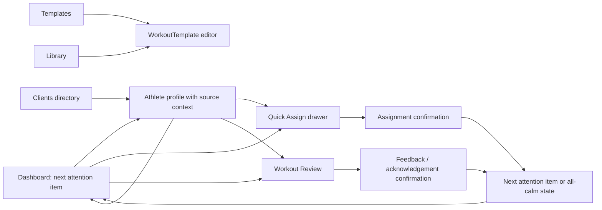

# Trainer Navigation and Screen Map v1

Date: 2026-07-16  
Status: finalized Stage 5 working information architecture; no route or navigation changes implemented.

## Navigation principles

- Primary navigation contains stable destinations, not every implemented prototype.
- Dashboard is the default queue and return point.
- Athlete profile, Quick Assign, and Workout Review are contextual workspaces, not primary sections.
- Experimental screens remain available in code and may be directly tested, but do not compete in MVP discovery.
- `Шаблоны` must mean saved WorkoutTemplate management and authoring; it must not imply multi-week Program management.

## Current navigation map

```text
TrainerShell
├── Primary rail: Главная / Клиенты / Библиотека / Шаблоны
├── Separate rail icon: Настройки
├── Mobile horizontal row: Search / Notifications / same primary items / Settings
└── Command palette
    ├── Dashboard, Attention, Clients, Messages, Programs, Builder, Calendar
    ├── Automation, Insights, Reports, Library, Sales, Settings
    ├── Seeded clients
    └── Global actions including experimental destinations
```

Evidence: `components/trainer/trainer-shell.tsx:55-58`, `:82-176`, `:427-580`.

The visible desktop rail is already close to the accepted candidate. The command palette and mobile treatment reopen the entire experimental product and make scope ambiguous.

## Accepted MVP navigation map

```text
Primary
├── Главная           /trainer/dashboard
├── Клиенты           /trainer/clients
├── Шаблоны           /trainer/builder (route retained; target IA changes later)
├── Библиотека        /trainer/library
└── Настройки         /trainer/settings

Contextual
├── Athlete profile   /trainer/clients/[clientId]
├── Workout review    /trainer/review/[workoutId]
├── Quick Assign      drawer from dashboard/profile
└── Exercise detail   sheet from library/builder/review

Hidden from MVP discovery, preserved in code
├── /trainer/attention
├── /trainer/messages
├── /trainer/reports
├── /trainer/automation
├── /trainer/insights
├── /trainer/sales
├── /trainer/programs (future advanced flow)
└── /trainer/calendar (return to navigation remains proposed)

Legacy
└── /dashboard/*
```

## Route status table

| Route | Role | Product status | UX readiness | Discovery proposal | Notes |
|---|---|---|---|---|---|
| `/trainer/dashboard` | Home and default queue | core MVP | requires significant iteration | Primary | Canonical return point. |
| `/trainer/clients` | Athlete directory | core MVP | requires significant iteration | Primary | Directory, not another queue center. |
| `/trainer/clients/[clientId]` | Athlete workspace | core MVP | requires significant iteration | Contextual | Carry source attention context. |
| `/trainer/builder` | Templates destination | core MVP | requires full redesign | Primary | Route may remain; target surface is template library/editor. |
| `/trainer/library` | Exercise library | core MVP | accepted foundation | Primary | Shared selection/detail primitives. |
| `/trainer/settings` | Workspace/account preferences | supporting MVP | requires significant iteration | Primary | Scope to beta-relevant sections. |
| `/trainer/review/[workoutId]` | Complex workout review | core MVP | requires significant iteration | Contextual | Enter from queue/profile; return/next explicit. |
| `/trainer/attention` | Dense all-items queue | experimental/duplicate | requires full redesign | Hidden | Could later serve 20-30 client scale, but is not primary MVP navigation. |
| `/trainer/programs` | Multi-week program management | future | visual/technical prototype only | Hidden | Outside first vertical slice. |
| `/trainer/calendar` | Weekly event command center | future/unclear | visual prototype only | Hidden pending research | Preserve. |
| `/trainer/messages` | Standalone inbox | experimental | requires significant iteration | Hidden | Communication remains contextual; standalone return requires trainer evidence. |
| Reports/Automation/Insights/Sales | Adjacent products | experimental | visual/technical prototype only | Hidden | Preserve code and assets. |

## Transition map



### Return behavior

- `К очереди` returns to the same queue position, not merely the top of dashboard.
- `Следующий клиент` opens the deterministic next unresolved AttentionItem.
- When the queue is empty, the coach sees an all-calm state and a secondary path to Clients.
- Opening an athlete from Clients uses a neutral profile context; opening from Attention shows source reason and return-to-queue affordance.

## Global actions

| Action | Placement | MVP treatment |
|---|---|---|
| Search athlete/template/exercise | Shell command/search | Keep; restrict results to MVP destinations by default. |
| Notifications | Shell | Keep only if notifications map to the same Attention/communication semantics. |
| Create template | Templates destination and optional global create | Keep after Builder redesign. |
| Add/invite athlete | Clients | Keep as secondary directory action; not a dashboard hero action. |
| Open next attention item | Dashboard and completion receipt | Add as primary workflow action. |

## Contextual actions

| Context | Primary | Secondary |
|---|---|---|
| Athlete needs assignment | Assign saved template | Open profile / template editor. |
| Completed workout needs review | Review exceptions and respond | Open full athlete history. |
| Athlete profile, neutral entry | Context-dependent recent action | Return to Clients. |
| Exercise | Add/select in active builder | Inspect technique. |
| Completed action | Next client | Return to same athlete/dashboard. |

## Attention and Programs route verdicts

### Separate Attention route

The job may become valid at 20-30 clients, but the current screen is not an accepted second home. It is hidden from global discovery while the route and UI are retained. Whether coaches later need a dense all-items view remains a research question after the dashboard queue is stabilized.

### Separate Programs route

Programs are outside the first vertical MVP. Keep the substantial prototype and its code, but do not use it as a dependency for assignment or review. `Шаблоны` should lead to WorkoutTemplate management, while Program orchestration remains a later layer.

## Mobile navigation

The current horizontally scrolling chip row avoids document overflow but hides destinations beyond the initial viewport (`components/trainer/trainer-shell.tsx:520-580`). Before internal pilot, use a stable compact pattern where the active destination and all five primary destinations remain discoverable without exploratory horizontal scrolling. This is a recommendation only; no final component is specified here.

## Hidden experimental zones

Hidden means removed from primary rail, default command results, and routine CTA paths, not deleted. Direct URLs can remain for internal evidence and later product work. The accepted experimental hidden set is Automation, Insights, Reports, Sales, standalone Attention Center, and standalone Messages. Programs remains a preserved future flow; Calendar remains outside the accepted five-section sidebar pending research.

## Legacy routes

`/dashboard/*` remains legacy by accepted strategy (`docs/product-strategy-v1.md:219-220`). It should not appear in target maps, but redirect/auth cleanup is outside Stage 5.

## Decision candidates for Product Lead review

### DC-NAV-01 - Five-item primary navigation

- **Status:** accepted.
- **Decision:** Use `Главная`, `Клиенты`, `Шаблоны`, `Библиотека`, `Настройки` as the complete first-pilot primary navigation.
- **Alternatives:** Add Attention; add Messages; add Calendar.
- **Recommendation:** Accept five items.
- **Rationale:** Each has a stable recurring job and matches accepted scope.
- **Affected routes/components:** `components/trainer/trainer-shell.tsx`, command palette, mobile navigation.
- **Risk:** Standalone communication/calendar needs may surface in research.
- **Urgency:** Before dashboard redesign.

### DC-NAV-02 - Contextual review placement

- **Status:** accepted working direction; drawer sufficiency remains subject to UX validation.
- **Decision:** Keep full-page review for complex sessions and use the drawer for quick review and acknowledgement built on the same review contract.
- **Alternatives:** Drawer only; page only; retain unrelated implementations.
- **Recommendation:** Hybrid by complexity, one data/action model.
- **Rationale:** The full page supports detailed set inspection; the drawer supports speed.
- **Affected routes/components:** `/trainer/review/[workoutId]`, `WorkoutReviewDrawer`.
- **Risk:** Two presentations still require strict parity tests.
- **Urgency:** Before profile redesign.

### DC-NAV-03 - Standalone Messages

- **Status:** accepted for first MVP; later return remains proposed.
- **Decision:** Keep communication contextual for the first vertical slice and hide standalone Messages from primary navigation while preserving its route and UI.
- **Alternatives:** Add Messages to primary navigation; remove messaging from MVP.
- **Recommendation:** Use the accepted contextual default; require evidence before restoring a standalone inbox to core navigation.
- **Rationale:** Feedback is core, but a full inbox is a separate workflow not yet validated.
- **Affected routes/components:** `/trainer/messages`, profile actions, review feedback.
- **Risk:** Coaches may organize their day around an inbox.
- **Urgency:** Before internal pilot.
