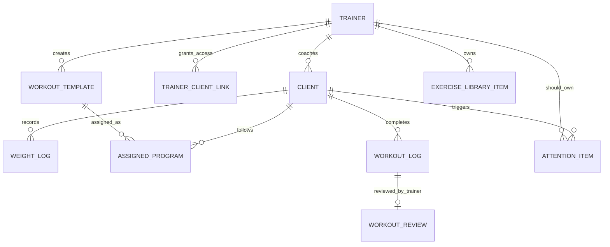

# Trainer Product Operating Audit

Дата: 2026-06-18

Документ объединяет последние продуктовые аудиты по тренерскому кабинету:

- фактическая карта экранов;
- карта сущностей;
- сравнение с Trainer Operating Model;
- аудит рабочего дня тренера;
- аудит Quick Assign;
- список дублирующих и вторичных экранов;
- рекомендации по MVP и рефакторингу.

Это не Figma и не план "в идеале". Основа документа - текущая реализация проекта.

---

## 1. Контекст продукта

Мы строим кабинет для премиального онлайн-тренера, который ведет примерно 10-30 активных клиентов.

Главный объект системы:

```text
Client
```

Основной рабочий цикл:

```text
Client -> Attention Item -> Action -> Next Client
```

Практический цикл дня тренера:

```text
Открыть кабинет
-> увидеть клиентов, которым нужно действие
-> быстро назначить тренировку / разобрать тренировку / написать клиенту
-> закрыть задачу
-> перейти к следующему клиенту
```

Операционная модель:

1. Client-centric.
2. Attention-driven.
3. Quick Assign workflow first.
4. Templates are primary.
5. Programs are secondary.

---

## 2. Фактическая карта экранов

### 2.1 Новый тренерский кабинет `/trainer/*`

| Route | Экран | Статус |
|---|---|---|
| `/trainer/dashboard` | Главный экран тренера / client route board / Quick Assign | Активный |
| `/trainer/attention` | Центр внимания / Attention inbox | Активный, в основном UI/demo state |
| `/trainer/clients` | Roster клиентов | Активный |
| `/trainer/clients/[clientId]` | Карточка клиента | Активный |
| `/trainer/review/[workoutId]` | Workout Review | Активный |
| `/trainer/builder` | Конструктор тренировки | Активный |
| `/trainer/programs` | Программы | Активный |
| `/trainer/calendar` | Weekly coaching calendar | Активный |
| `/trainer/library` | Библиотека упражнений | Активный |
| `/trainer/messages` | Сообщения | Активный |
| `/trainer/reports` | Отчеты | Активный |
| `/trainer/automation` | Автоматизация | Активный |
| `/trainer/insights` | Инсайты | Активный |
| `/trainer/sales` | Продажи | Активный |
| `/trainer/settings` | Настройки тренера | Активный |

Главный layout:

```text
components/trainer/trainer-shell.tsx
```

### 2.2 Старый тренерский/admin кабинет `/dashboard/*`

| Route | Экран | Статус |
|---|---|---|
| `/dashboard` | Старый dashboard тренера | Legacy |
| `/dashboard/analytics` | Аналитика / платежи | Legacy |
| `/dashboard/clients/[id]` | Старая карточка клиента | Legacy |
| `/dashboard/library` | Старая библиотека упражнений | Legacy |
| `/dashboard/programs` | Старые программы | Legacy |
| `/dashboard/programs/[id]` | Старый program builder | Legacy |
| `/dashboard/subscribe` | Redirect на `/dashboard` | Redirect-only |
| `/settings` | Старые настройки тренера | Legacy |
| `/programs/[id]` | Старый program detail | Legacy |

Вывод: в проекте одновременно существуют новый `/trainer/*` и старый `/dashboard/*`. Это создает дублирование продукта.

### 2.3 Клиентский кабинет

| Route | Экран | Статус |
|---|---|---|
| `/client/me` | Главная клиента | Активный |
| `/client/settings` | Настройки клиента | Активный |
| `/client/library` | Библиотека клиента | Активный |
| `/client/dashboard` | Redirect на `/client/me` | Redirect-only |
| `/client/workouts` | Demo page или redirect на `/today` | Частично redirect |
| `/client/activity` | Demo page или redirect на `/history` | Частично redirect |
| `/client/progress` | Demo page или redirect на `/history` | Частично redirect |
| `/client/[id]` | Клиентская тренировка / workout execution | Активный |
| `/client/[id]/program/[programId]` | Клиентская программа | Активный |
| `/check-in` | Чек-ин / вес / самочувствие | Активный |
| `/history` | История тренировок | Активный |
| `/profile` | Профиль клиента | Активный |
| `/programs` | Программы клиента | Активный |
| `/today` | Redirect на `/client/me` | Redirect-only |
| `/today/select` | Redirect на `/client/me` | Redirect-only |
| `/workout/free` | Свободная тренировка | Активный |
| `/explore` | Каталог программ | Активный |
| `/explore/[id]` | Детальная страница программы | Активный |

### 2.4 Публичные и auth-страницы

| Route | Экран | Статус |
|---|---|---|
| `/` | Home / landing entry | Активный |
| `/landing` | Landing route | Активный |
| `/login` | Login | Активный |
| `/signup` | Signup | Активный |
| `/trainers` | Каталог тренеров | Активный |
| `/t/[slug]` | Публичная страница тренера | Активный |
| `/support` | Support | Активный |
| `/terms` | Terms | Активный |

### 2.5 API endpoints

| Route | Назначение |
|---|---|
| `/api/trainer/programs` | Создание/обновление программ |
| `/api/create-payment-link` | Payment link |
| `/api/webhooks/payment` | Payment webhook |
| `/api/tg-webhook` | Telegram webhook |
| `/api/send-reminder` | Отправка напоминаний |
| `/api/notify-complete` | Уведомление о завершении |
| `/api/link-trainer` | Связать клиента с тренером |
| `/api/ensure-profile` | Создать/проверить профиль |
| `/api/seed-test-users` | Тестовые пользователи |
| `/api/test-env` | Проверка env |

---

## 3. Реальные модалки, drawers и sheets

| Компонент | Где находится | Назначение |
|---|---|---|
| Command Dialog | `TrainerShell` | Глобальный поиск/командная палитра тренера |
| Notifications Sheet | `TrainerShell` | Уведомления тренера |
| Quick Assign Drawer | `/trainer/dashboard` | Быстро назначить тренировку |
| Exercise Detail Sheet | `components/trainer/exercise-detail-sheet.tsx` | Деталка упражнения |
| Event Drawer | `/trainer/calendar` | Деталка события календаря |
| Invite Client Sheet | `/trainer/clients` | Пригласить клиента |
| Add Client Sheet | `/trainer/clients` | Добавить клиента |
| Filters Sheet | `/trainer/clients` | Фильтры roster |
| Message Client Sheet | `/trainer/clients` | Быстро написать клиенту |
| Client Actions Sheet | `/trainer/clients` | Быстрые действия по клиенту |
| Assign Program Sheet | `/trainer/programs` | Назначить программу |
| New Product Sheet | `/trainer/sales` | Создать продукт |
| New Report Sheet | `/trainer/reports` | Создать отчет |
| New Automation Rule Sheet | `/trainer/automation` | Создать правило |
| Add/Edit Exercise Sheet | `/trainer/library` | Добавить/редактировать упражнение |
| Explore Program Dialog | `/explore` | Деталка программы |
| Legacy Payment Dialog | `/dashboard/analytics` | Добавить платеж |
| Legacy Program Dialog | `/dashboard/programs` | Создать программу |
| Legacy Library Sheet | `/dashboard/library` | Добавить упражнение |
| Legacy Program Library Sheet | `/dashboard/programs/[id]` | Выбор упражнения |

---

## 4. Основные компоненты

### 4.1 Trainer components

| Component | Назначение |
|---|---|
| `TrainerShell` | Общий layout, sidebar/nav, search, notifications |
| `ExerciseDetailSheet` | Единая деталка упражнения |
| `ExerciseLibraryPanel` | Панель библиотеки упражнений для builder |
| `WorkoutExerciseCard` | Карточка упражнения в builder |
| `workout-builder-types.ts` | Типы builder-плана |
| `workout-form-header.tsx` | Похоже, сейчас не используется |

### 4.2 Client/demo components

| Component | Назначение |
|---|---|
| `MobileCabinetNav` | Нижняя навигация клиента |
| `WeightTracker` | Трекер веса |
| `ShareCard` | Share card |
| `DemoClientCabinet` | Большой demo-клиентский кабинет |
| `DemoPages` | Demo routes/pages |
| `ClientMiniAnalyticsCard` | Мини-аналитика клиента |
| `HeroSection`, `TrainerCard`, `AchievementsStrip`, `RecommendedPrograms` | Старые/частичные компоненты клиентского dashboard |

---

## 5. Entity Relationship Report

### 5.1 Главная модель MVP



Главный архитектурный разрыв:

```text
Attention Item - главный продуктовый объект, но сейчас не является реальной persisted entity.
```

### 5.2 Core MVP entities

| Entity | Purpose | Fields | Relationships | Where used | MVP |
|---|---|---|---|---|---|
| Profile/User | Identity record для trainer/client/admin | `id`, `role`, `full_name`, `email`, `display_name`, `team_logo_url`, `slug`, `telegram_id`, `trainer_id`, `weight`, `height`, `target_weight`, `is_paid`, timestamps | Trainer и Client сейчас являются ролями профиля | Login, signup, trainer/client кабинеты | Critical |
| Trainer | Тренер, который ведет клиентов | Поля profile + storefront/public fields | Has many clients, programs, exercises, reviews, messages | `/trainer/*`, `/dashboard/*`, `/t/[slug]` | Critical |
| Client | Главный объект системы | `id`, `full_name`, `email`, `trainer_id`, `weight`, `height`, `target_weight`, `telegram_id`, timestamps | Belongs to trainer; has logs/programs/reviews/messages | `/trainer/clients`, `/client/me`, `/check-in` | Critical |
| Trainer Client Link | Access/control relationship | `trainer_id`, `client_id`, `access_granted` | Connects trainer and client | Client detail, link APIs | Critical |
| Workout Template / Program | Reusable training structure | `id`, `trainer_id`, `title`, `description`, `weeks`, `price`, `is_public`, `difficulty`, `goal`, `cover_url`, `status`, `plan_json` | Created by trainer; assigned to clients | Programs, Builder, Client programs | Critical |
| Program Plan JSON | Nested weeks/days/exercises | `weeks[]`, `days[]`, `exercises[]`, targets | Belongs to template/program | Builder, workout execution | Critical |
| Assigned Program | Program assigned to client | `id`, `client_id`, `template_id`, `status`, timestamps | Client follows template/program | Client/trainer pages | Critical |
| Workout Log | Actual performed workout data | `client_id`, `template_id`, `exercise_id`, `performed_weight`, `performed_reps`, `completed`, `created_at` | Belongs to client/exercise/template | History, review, client profile | Critical |
| Workout Review | Trainer review/comment | `trainer_id`, `client_id`, `workout_date`, `status`, `comment`, `reviewed_at`, `client_seen_at` | Trainer reviews client workout | Review page, client home | Critical |
| Weight Log | Measurement history | `id`, `client_id`, `weight`, `created_at` | Belongs to client | Check-in, progress | Critical |

### 5.3 Coaching operations entities

| Entity | Purpose | Current State | MVP |
|---|---|---|---|
| Attention Item | Unified task object: what requires coach action | UI/demo only | Critical, missing DB table |
| Calendar Event | Derived rhythm event | UI state in calendar | Important, derived |
| Upcoming Risk | Future problem prediction | UI state | Important, derived |
| Quick Assign Draft | Temporary assignment workspace | Dashboard-local state | Critical workflow, not DB entity |
| Builder Template | Saved workout template | Real table `trainer_builder_templates` | Important |
| Exercise Library Item | Exercise reference with technique | Real table `exercise_library` | Critical |
| Legacy Exercise | Old fallback exercise table | Still used in fallback code | Migrate away |

### 5.4 Communication, reporting, commerce, automation

| Entity | Purpose | MVP decision |
|---|---|---|
| Trainer Client Message | Built-in messages | Optional unless chat is core |
| Message Thread | UI aggregation | Derived |
| Reply Template | Reusable response | Useful, not critical |
| Client Insight | Analytics snapshot | Later |
| Insight Action | Action from insight | Should merge into Attention Item |
| Client Report | Weekly report | Optional MVP |
| Payment | Payment event | Not core coaching MVP |
| Sales Product | Sellable product | Later |
| Program Product / Purchase | Commerce wrappers | Later |
| Subscription | Platform billing | Not core coaching flow |
| Trainer Settings | Trainer config | Important |
| Automation Rule | Automation source | Later |
| Automation Queue Item | Automation output | Should become Attention Item |
| Trainer Reminder | Reminder contract | Useful later |

### 5.5 Declared but incomplete entities

| Entity | Problem | Why it matters |
|---|---|---|
| Workout Assignment | Typed in contracts, but not clearly canonical in current DB flow | Quick Assign needs to create real assigned workouts |
| Workout | Session instance is not clearly separated from logs | Review and assignment flow need exact workout instance |
| Progress Photo | Typed, not core implemented | Optional |
| Client Training Preference | Typed, not core implemented | Useful for calendar and assignment recommendations |

---

## 6. Product architecture map

### 6.1 Current high-level architecture

```text
Product
├─ Public/Auth
│  ├─ /
│  ├─ /landing
│  ├─ /login
│  ├─ /signup
│  ├─ /trainers
│  └─ /t/[slug]
│
├─ Client App
│  ├─ /client/me
│  ├─ /client/settings
│  ├─ /client/library
│  ├─ /client/[id]
│  ├─ /check-in
│  ├─ /history
│  ├─ /programs
│  └─ /workout/free
│
├─ Trainer App
│  ├─ /trainer/dashboard
│  ├─ /trainer/attention
│  ├─ /trainer/clients
│  ├─ /trainer/clients/[clientId]
│  ├─ /trainer/review/[workoutId]
│  ├─ /trainer/builder
│  ├─ /trainer/programs
│  ├─ /trainer/calendar
│  ├─ /trainer/library
│  ├─ /trainer/messages
│  ├─ /trainer/reports
│  ├─ /trainer/automation
│  ├─ /trainer/insights
│  ├─ /trainer/sales
│  └─ /trainer/settings
│
└─ Legacy Admin/Trainer
   ├─ /dashboard
   ├─ /dashboard/analytics
   ├─ /dashboard/clients/[id]
   ├─ /dashboard/library
   ├─ /dashboard/programs
   └─ /dashboard/programs/[id]
```

### 6.2 Potential duplicates

| Duplicate | Comment |
|---|---|
| `/trainer/dashboard` vs `/dashboard` | New vs old trainer dashboard |
| `/trainer/clients/[clientId]` vs `/dashboard/clients/[id]` | Two client detail pages |
| `/trainer/library` vs `/dashboard/library` | Two exercise libraries |
| `/trainer/programs` vs `/dashboard/programs` | Two program libraries |
| `/trainer/builder` vs `/dashboard/programs/[id]` | Two builder concepts |
| `/trainer/settings` vs `/settings` | Two trainer settings areas |
| `/client/me` vs `/client/dashboard` | Redirect duplication |
| `/history` vs `/client/activity` and `/client/progress` | Redirect/demo overlap |

### 6.3 Dead or redirect-only screens

| Route | Current behavior |
|---|---|
| `/client/dashboard` | Redirect to `/client/me` |
| `/client/workouts` | Demo page or redirect to `/today` |
| `/client/activity` | Demo page or redirect to `/history` |
| `/client/progress` | Demo page or redirect to `/history` |
| `/today` | Redirect to `/client/me` |
| `/today/select` | Redirect to `/client/me` |
| `/dashboard/subscribe` | Redirect to `/dashboard` |

---

## 7. Trainer Operating Model alignment

### 7.1 Alignment score

Overall score:

```text
58/100
```

| Principle | Score | Current State |
|---|---:|---|
| Client-centric | 7/10 | Dashboard and Clients focus on clients, but Programs/Insights/Sales pull focus away |
| Attention-driven | 5/10 | Attention page exists, but Attention Item is not canonical |
| Quick Assign first | 5/10 | Strong Quick Assign exists, but only inside dashboard |
| Templates primary | 5/10 | Templates exist, but Programs are more prominent |
| Programs secondary | 3/10 | Programs are still top-level major module |

### 7.2 Strong matches

| Area | Why it matches |
|---|---|
| `/trainer/dashboard` | Best-aligned screen right now: clients, next workout, waiting review, no next workout, Quick Assign |
| Quick Assign drawer | Correct workflow: template selection, previous loads, assignment draft, assign and next |
| `/trainer/clients` | Roster direction is right: client list, status, attention state, fast opening |
| `/trainer/review/[workoutId]` | Supports completed workout -> review -> comment -> close task |
| Exercise library/modal | Shared object for templates, builder, review, client experience |

### 7.3 Weak matches and violations

| Issue | Type | Explanation | Recommendation |
|---|---|---|---|
| Attention Item is UI-only | Missing model feature | Central object is not persisted | Create real `attention_items` table |
| Quick Assign is not global | Workflow violation | Exists only on dashboard | Extract shared Quick Assign component/provider |
| Templates are buried | Model violation | Templates live inside Builder/Quick Assign, Programs dominate nav | Make Templates primary |
| Programs are too prominent | Model violation | Top-level major module despite secondary principle | Demote to program cycles/bundles |
| Too many command centers | Cognitive load | Dashboard, Attention, Calendar, Insights, Clients all answer "what next?" | Give each screen one job |
| Navigation is too broad | Complexity | 12 trainer nav items | Reduce MVP nav |
| Legacy `/dashboard/*` exists | Duplication | Old trainer app competes with new one | Redirect or hide legacy |

### 7.4 Features that do not support the model

| Feature | Why it conflicts |
|---|---|
| `/trainer/insights` as top-level | BI/analytics behavior, not daily coaching |
| `/trainer/sales` as top-level | Revenue/products distract from active coaching |
| `/trainer/automation` as top-level | Advanced mode; output should be Attention Items |
| `/trainer/reports` as top-level | Should be contextual from client/task |
| Full `/trainer/messages` module | Can compete with Attention if real comms happen in Telegram/WhatsApp |

---

## 8. Coach workday simulation

### 8.1 Morning login

Current flow:

```text
Trainer opens app -> sees Dashboard -> also has Attention, Clients, Calendar, Insights, Messages
```

Problem:

There are too many possible starts for the same question: "What do I do first?"

Impact:

Coach wastes mental energy choosing between screens.

Suggested improvement:

Dashboard should show a client route board:

```text
Client | Today workout status | Next workout | Waiting review | Main action
```

### 8.2 Reviewing completed workouts

Current flow:

```text
Dashboard/Clients/Calendar -> Workout Review -> Client Profile or next route
```

Problem:

Review exists, but closing the loop is not fully connected to canonical Attention Item.

Impact:

Trainer can review, but the system does not reliably remove the task everywhere.

Suggested improvement:

Review completion should:

```text
mark review as reviewed
-> close related Attention Item
-> remove from dashboard/review queue
-> suggest next client
```

### 8.3 Assigning new workouts

Current flow:

```text
Dashboard Quick Assign works well
Other places often route to Builder or Programs
```

Problem:

Quick Assign is not global.

Impact:

The fastest workflow is only available from one screen.

Suggested improvement:

Quick Assign should open from:

- Dashboard;
- Clients roster;
- Client profile;
- Attention item;
- Calendar event;
- Review screen.

### 8.4 Opening client profiles

Current flow:

```text
Client list -> Client profile with broad overview/history/program/reviews/metrics
```

Problem:

Client profile contains many information areas, but not always a single next action.

Impact:

Coach can lose context after opening a client.

Suggested improvement:

Client profile top should always answer:

```text
What is the current state?
What requires attention?
What should I do next?
```

### 8.5 Reviewing history

Current flow:

Workout logs and weight logs are shown in multiple places.

Problem:

History is available but fragmented.

Impact:

Coach may need several clicks to understand previous loads.

Suggested improvement:

Previous loads should be inline inside:

- Quick Assign;
- Workout Review;
- Client Profile current training block;
- Builder exercise configuration.

### 8.6 Creating/editing templates

Current flow:

Builder supports saved templates and programs, but Programs screen is more prominent than templates.

Problem:

Operating model says Templates are primary, Programs secondary.

Impact:

Coach may think in heavy programs instead of fast reusable workout templates.

Suggested improvement:

Make template library a first-class workflow:

```text
Template -> Quick Assign -> Adjust loads -> Assign
```

Builder should be advanced editing, not default assignment.

---

## 9. Quick Assign audit

Goal:

```text
Coach should assign next workout to a client in under 60 seconds.
```

### 9.1 Current strengths

- Exists on `/trainer/dashboard`.
- Opens as drawer without leaving page.
- Shows client context.
- Shows templates.
- Shows exercise list and planned weights.
- Supports weight adjustment.
- Has "Assign" and "Assign and next".

### 9.2 Current blockers

| Blocker | Problem | Impact |
|---|---|---|
| Dashboard-local only | Not reusable from other screens | Coach loses speed outside dashboard |
| Not persisted as real WorkoutAssignment | Assignment updates local state | Cannot trust workflow as real product data |
| Templates are local/demo in dashboard | Not unified with Builder templates/program templates | Fragmented source of truth |
| Builder still acts as assignment destination | Too heavy for fast daily assigning | More clicks |
| Previous loads not globally available | Some context exists, but not canonical | Slower decisions |
| No universal confirmation flow | Assignment does not close related Attention Item everywhere | Task loop incomplete |

### 9.3 Desired Quick Assign flow

```text
Open client/action
-> Quick Assign drawer opens
-> Recommended template is preselected
-> Previous loads visible inline
-> Coach chooses load strategy
-> Assign
-> Attention Item closes
-> Next client opens
```

Target interaction count:

```text
3-5 actions
```

Recommended default options:

- Assign recommended;
- Repeat last workout;
- Choose template;
- Progress load;
- Deload;
- Technique day;
- Assign and next.

---

## 10. Screens by product role

### 10.1 Task-oriented screens

| Screen | Task |
|---|---|
| `/trainer/dashboard` | Decide who needs workout/review today |
| `/trainer/attention` | Work through tasks |
| `/trainer/review/[workoutId]` | Review completed workout |
| `/trainer/builder` | Build/edit workout |
| `/trainer/clients` | Find client and act |
| `/trainer/clients/[clientId]` | Understand client state and act |
| `/trainer/calendar` | Manage weekly rhythm |

### 10.2 Information-oriented screens

| Screen | Type |
|---|---|
| `/trainer/insights` | Analytics / BI |
| `/trainer/reports` | Reporting |
| `/trainer/sales` | Commerce |
| `/trainer/automation` | Configuration / automation |
| `/trainer/settings` | Configuration |

### 10.3 Screens that should be redesigned or demoted

| Screen | Recommendation |
|---|---|
| `/trainer/dashboard` | Keep as main client route board |
| `/trainer/attention` | Make canonical persisted task inbox |
| `/trainer/clients` | Keep as roster, remove dashboard-like duplication |
| `/trainer/clients/[clientId]` | Rebuild around current state + next action |
| `/trainer/builder` | Make advanced editor, not default assign flow |
| `/trainer/programs` | Demote; make Templates primary |
| `/trainer/calendar` | Keep as rhythm preview, not another task inbox |
| `/trainer/messages` | Make contextual or hide from MVP |
| `/trainer/insights` | Hide from MVP nav |
| `/trainer/sales` | Hide from MVP nav |
| `/trainer/automation` | Hide from MVP nav |
| `/trainer/reports` | Hide from MVP nav |

---

## 11. MVP-critical components and screens

### 11.1 Keep for MVP

| Item | Why |
|---|---|
| `/trainer/dashboard` | Main operating screen |
| `/trainer/clients` | Client roster |
| `/trainer/clients/[clientId]` | Client cockpit |
| `/trainer/attention` | Task inbox, once persisted |
| `/trainer/review/[workoutId]` | Critical coaching workflow |
| Global Quick Assign | Core assignment workflow |
| `/trainer/builder` | Advanced editing |
| `/trainer/library` | Exercise source |
| `/trainer/calendar` | Weekly rhythm |
| `/trainer/settings` | Trainer config |
| `TrainerShell` | Main shell/nav |
| `ExerciseDetailSheet` | Shared exercise details |
| `ExerciseLibraryPanel` | Builder/library integration |
| `WorkoutExerciseCard` | Builder canvas |

### 11.2 Hide or demote for MVP

| Item | Why |
|---|---|
| `/trainer/insights` | Too BI-like for first version |
| `/trainer/sales` | Not core for premium coaching workflow |
| `/trainer/automation` | Advanced feature; output should be Attention Items |
| `/trainer/reports` | Useful later, but not core daily operation |
| `/dashboard/*` | Legacy duplicate |
| `workout-form-header.tsx` | Appears unused |
| `BackgroundShader.tsx` | Appears unused |
| `components/demo/*` | Demo-only, not core product |

---

## 12. Recommended MVP navigation

Current trainer nav is too broad:

```text
Dashboard
Attention
Clients
Messages
Programs
Builder
Calendar
Automation
Insights
Reports
Library
Sales
```

Recommended MVP nav:

```text
Главная
Клиенты
Внимание
Шаблоны
Календарь
Библиотека
Настройки
```

Contextual only:

```text
Builder
Programs
Messages
Reports
Sales
Automation
Insights
```

---

## 13. Recommended refactoring plan

### Phase 1. Make `/trainer/*` canonical

- Treat `/trainer/*` as the real trainer product.
- Redirect or hide `/dashboard/*`.
- Ensure login sends trainers to `/trainer/dashboard`, not legacy dashboard.

### Phase 2. Create persisted Attention Item

Create canonical entity:

```text
attention_items
```

Minimum fields:

```text
id
trainer_id
client_id
category
reason
detail
priority
status
source_type
source_id
primary_action_type
primary_action_href
secondary_action_href
snoozed_until
created_by
created_at
updated_at
closed_at
```

All task-like objects should either be Attention Items or derived from them.

### Phase 3. Extract Global Quick Assign

Move Quick Assign out of `/trainer/dashboard` into shared trainer component/provider.

Open it from:

- Dashboard;
- Clients roster;
- Client profile;
- Attention;
- Calendar;
- Review.

### Phase 4. Add real WorkoutAssignment

Quick Assign should create real assigned workouts, not just local dashboard state.

Required model:

```text
workout_assignments
```

It should connect:

```text
trainer_id
client_id
template_id
program_id optional
scheduled_date
status
assignment_payload
```

### Phase 5. Make Templates primary

Promote templates above programs.

Working model:

```text
Template -> Quick Assign -> Adjust -> Assign
```

Programs become secondary grouping:

```text
Program = sequence/bundle of templates
```

### Phase 6. Rebuild Client Profile as cockpit

Top of client profile should show:

```text
Current State
Open Attention Items
Next Workout
Last Workout
Previous Loads
Main Action
```

### Phase 7. Simplify Dashboard

Dashboard should be:

```text
Client route board for today
```

Not:

- BI dashboard;
- sales overview;
- analytics page;
- decorative card wall.

Suggested columns:

```text
Client
Today
Next workout
Last workout
Waiting review
Status
Action
```

### Phase 8. Hide secondary modules from MVP

Move these out of primary nav:

- Sales;
- Insights;
- Reports;
- Automation;
- Messages, unless in-app chat is core.

---

## 14. Final product direction

The product should not grow by adding more top-level screens.

The next important step is to make the existing screens obey one operating loop:

```text
Client
-> Attention Item
-> Quick Assign / Review / Message
-> Close task
-> Next Client
```

The strongest current base is:

```text
/trainer/dashboard
/trainer/clients
/trainer/clients/[clientId]
/trainer/review/[workoutId]
/trainer/builder
/trainer/library
```

The biggest missing foundation is:

```text
Persistent Attention Item + Global Quick Assign + Real Workout Assignment
```

Once these three are in place, the trainer cabinet can become a real operating system for a premium coach rather than a collection of separate pages.
